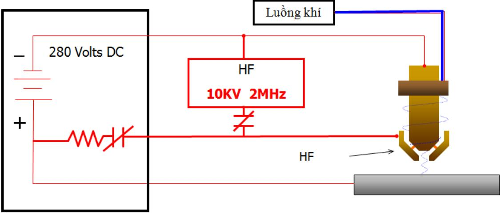
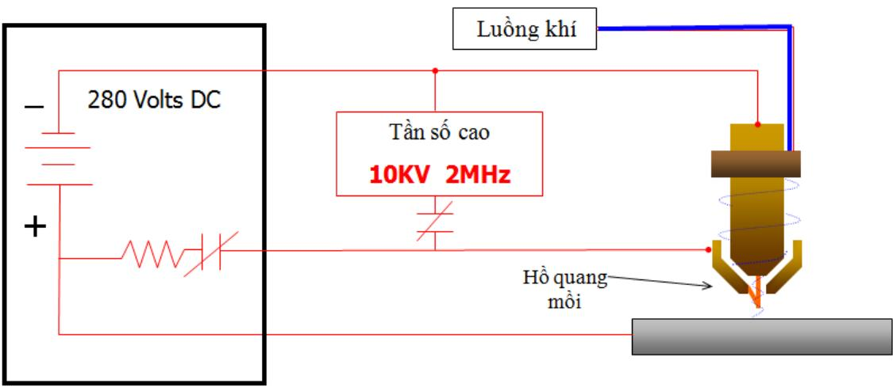
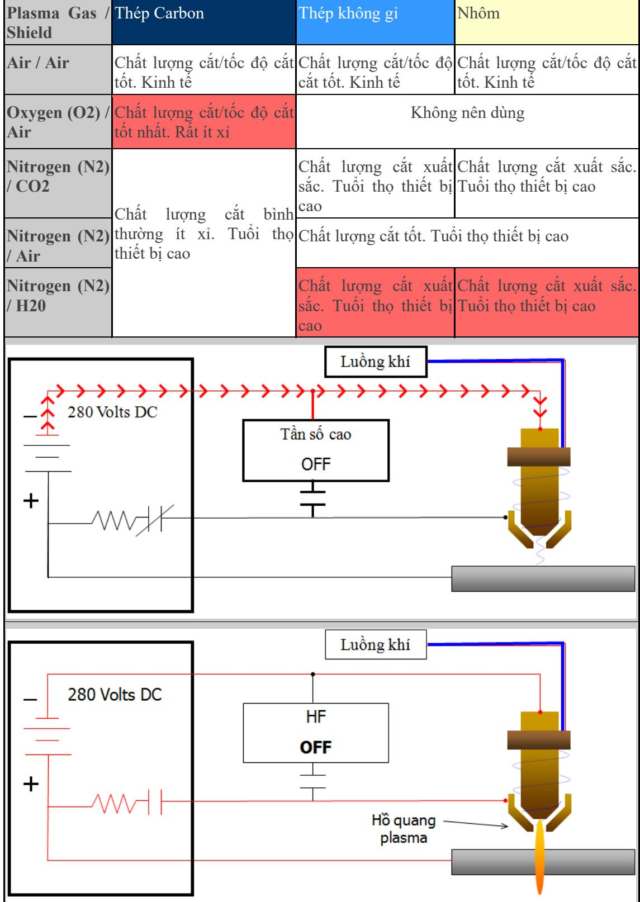

# 1. Khái niệm Plasma và nguyên lý hoạt động của mỏ cắt Plasma

Định nghĩa: “Plasma là tập hợp các hạt tích điện bao gồm số lượng tương đương các ion dương và các điện tử và có vài đặc tính của khí nhưng khác với khí là có tính dẫn điện tốt”. Sự ion hóa khí tạo ra các điện tử tự do và các ion dương giữa các nguyên tử khí. Khi điều này xảy ra, khí trở thành dẫn điện với khả năng mang dòng điện.

Một ví dụ của plasma được thấy trong tự nhiên là hiện tượng tia chớp thường hay xảy ra khi bầu trời có mưa giông. Giống như tia plasma phát ra từ mỏ plasma, tia chớp phóng từ vị trí này sang vị trí khác, giữa hai đám mây tích điện. Trong không gian hình thành tia chớp, các loại khí trong không trung là khí ion hóa, trở nên dẫn điện.

# Nguyên lý hoạt động của mỏ cắt plasma

Cắt Plasma là quy trình sử dụng miệng đầu phun thích hợp để làm thắt lại luồng khí ion hóa có nhiệt độ rất cao sao cho có thể sử dụng để làm nóng chảy và cắt đứt các kim loại dẫn điện.

Khí dẫn điện (plasma) được sử dụng để chuyển năng lượng âm - cung cấp bởi một nguồn điện từ mỏ plasma đến vật liệu cắt. Mỏ plasma đóng vai trò như là công cụ lắp các phụ tùng tiêu hao và có vai trò cung cấp chất làm mát (khí hoặc nước) cho các phụ tùng này. Đầu phun và điện cực duy trì tia plasma.

Một tín hiệu khởi động được gửi tới nguồn công suất DC. Khi đó, đồng thời xuất hiện điện áp mạch hở (OCV) và khí phun ra mỏ.

Sau khi có luồng khí ổn định, mạch tần số cao (HF) được kích hoạt. HF phóng hồ quang giữa điện cực và đầu phun bên trong mỏ và hồ quang làm cho khí thổi qua đó bị ion hóa.

Khí dẫn điện tạo nên dòng điện giữa điện cực và đầu phun và kết quả là hình thành hồ quang mồi (pilot arc).

Khi hồ quang mồi tiếp xúc với vật cắt, hồ quang plasma hình thành giữa điện cực và vật cắt. Hồ quang plasma làm nóng chảy kim loại, và luồng khí tốc độ cao thổi đi kim loại nóng chảy.

# 2. Chọn khí sử dụng trong cắt Plasma

Bài viết này sẽ giới thiệu các loại khí được sử dụng trong cắt plasma, ưu điểm và nhược điểm của mỗi loại khí khi thực hiện cắt cho thép, thép không gỉ và nhôm.

Các loại khí được sử dụng trong cắt Plasma: Không khí được làm sạch, Oxy, khí ni tơ, hỗn hợp khí Argon – Hidro.

Cắ plasma sử dụng không khí: Khí được sử dụng phổ biến nhất trong cắt plasma, nó cung cấp tốc độ cắt, và chất lượng cắt tốt với thép cacbon, thép không gỉ và nhôm. Giá thành thấp là một lợi thế khi sử dụng không khí. Tuy nhiên trước khi được sử dụng không khí phải được làm sạch, loại bỏ bụi bẩn, hơi nước. Khi sử dụng không khí cần phải chọn hệ thống khí nén, lọc thích hợp với yêu cầu cắt. Một trong các vấn đề của cắt plasma sử dụng không khí là ảnh hưởng của nó lên mối hàn đường cắt plasma. Đường cắt thường có các vùng bị ni tơ hóa, oxy hóa. Điều này ảnh hưởng đến mối hàn. Nó được giải quyết tốt khi sử dụng dây hàn có chứa chất khử nito, oxy. Với các ưu điểm tốc độ cắt tốt, xỉ ít, tuổi thọ của các thiết bị tiêu hao trung bình. Không khí là một lựa chọn tốt nhất cho cắt plasma trong các xưởng nhỏ.

Cắt plasma sử dụng khí Oxy: là lựa chọn hàng đầu trong các nhà máy khi cắt các tấm thép Carbon vì chúng mang lại chất lượng mối cắt tốt nhât, tốc độ cắt nhanh nhất. Oxy sẽ tương tác với thép carbon giảm nhiệt độ nóng chảy do tạo ra oxit tạo đường cắt min hơn do kích thước hạt nóng chảy nhỏ. Nhược điểm của cắt plasma sử dụng oxy đó là giá thành của khí sử dụng cao, cũng như tuổi thọ thiết bị tiêu hao thấp. Tuy nhiên thực tế người ta thường sử dụng khí nito khi bắt đầu hồ quang plasma do đó sẽ cải thiện được tuổi thọ của thiết bị tiêu hao ngang bằng với cắt plasma sử dụng không khí. Chi phí cho khí oxy và thiết bị tiêu hao cao, nhưng cắt plasma sử dụng khí oxy bù lại với năng xuất cao và chất lượng mối cắt tốt.

Cắt plasma sử dụng khí ni tơ: Phương pháp được sử dụng phổ biến trong quá khứ và nó vẫn là lựa chọn tốt nhất khi cắt nhôm hoặc thép không gỉ do chất lượng đường cắt và tuổi thọ thiết bị tiêu hao. Tuy nhiên với tấm nhôm hoặc thép không gỉ dày trên 0.5 inch thì nên chuyển sang sử dụng hỗn hợp khí argon $^ +$ hidro. Bình thường không khí được sử dụng làm khí bảo vệ. Nếu sử dụng CO2 có thể cải thiện phẩn nào chất lượng cũng như tốc độ cắt. Nước cũng được sử dụng với cắt plasma nito. Nước đảm bảm đường cắt nhẵn bóng khi cắt nhôm, thép không gỉ. Khi sử dụng với nước cắt plasma nito thường sử dụng bàn cắt nước.

Cắt plasma sử dụng Argon- Hidro: khi cắt nhôm và thép không gỉ dày trên 0.5inch hỗn hợp khí $3 5 \%$ Hidro, $65 \%$ argon thường được sử dụng. Hỗn hợp khí cung cấp nhiệt độ cắt plasma cao nhất (với hệ thống plasma 1000Amp có kèm phun nước sử dụng khí argon-hidro có thể cắt thép không gỉ dày đến 15cm). Cắt plasma sử dụng argon-hidro cung cấp đường cắt cực kì min với thép không rỉ, Nito thường được chọn là khí bảo vệ trong trường hợp này. Yếu điểm của hệ thống như này đó là chi phí cho thiết bị và chi phí vận hành.

# 3. Video kỹ thuật cắt plasma cơ bản

Các video này được đi kèm theo bài viết về các kỹ thuật cắt Plasma cơ bản được hãng Miller giới thiệu, các tài liệu được dịch bởi Weldcom. Bạn có thể xem bài viết tại Kỹ thuật cơ bản khi cắt Plasma nếu không nghe hiểu tiếng Anh.

Phần 1: Các kỹ thuật cắt và thủ thuật.

Phần 2: Các chuẩn bị, quy tắc an toàn, và cách để có đường cắt chính xác.

# 4. Kỹ thuật cơ bản khi cắt plasma

Khi sử dụng cắt plasma cho công việc cần phải chú ý một số kỹ thuật sẽ nâng cao tốc độ làm việc, cũng như chất lượng mối cắt, phần đầu của tài liệu này sẽ mô tả các kỹ thuật giúp cải thiện chất lượng đường cắt plasma. Phần 2 sẽ cung cấp các yêu cầu về an toàn, trang bị cho người công nhân trong quá trình làm việc với máy cắt plasma.

# Phần 1: Các kỹ thuật cắt và thủ thuật.

1. Trước khi bạn thực hiện cắt. Sử dụng cánh tay không cầm súng hỗ trợ cho tay cầm súng điều này giúp giữ vững tay cầm súng cũng như giúp duy trì khoảng cách của đầu súng với vật cắt. Bạn cần lưu ý rằng hầu hết mọi người đều cảm thấy dễ dàng khi di chuyển súng cắt về phía mình hơn là đưa súng ra xa.

2. Trước khi thực hiện cắt công nhân cắt cần chú ý đến đường cắt, với đường cắt dài cần phải thử thao tác di chuyển tay cắt để chắc chắc mức độ thuần thục của tay cắt khi thực hiện cắt thực tế. Dừng tay cắt hoặc bắt đầu lại trong quá trình cắt thực tế tại điểm dừng sẽ là rất khó khăn và có thể gây ra ảnh hưởng xấu đến chất lượng đường cắt.

3. Công nhân kỹ thuật cần phải đảm bảo rằng bạn sử dụng đúng dòng cắt và tốc độ cắt, cần phải cắt thử trên cùng một loại vật liệu mà bạn sẽ thực hiện trên thực tế.

4. Nếu xuất hiện các tia lửa plasma trên bề mặt vật cắt, điều đó có nghĩa là bạn đã di chuyển tay cắt quá nhanh. Với một tốc độ cắt phù hợp hồ quang plasma nên duy trì ở góc 15 đến 20 độ so với hướng di chuyển.

5. Đối với vật liệu dày, đoạn cuối đường cắt có thể không được như ý nếu bạn không thực hiện cẩn thận. Để có được một đường cắt có kết thúc tốt bạn nên tạm dừng di chuyển tay cắt trong một thời gian ngắn để có thể cắt hoàn toàn phần kim loại còn lại trên đường cắt.

6. Khi cắt vật dày xỉ cắt plasma có thể đọng cứng bên dưới đường cắt, bạn không cần phải lo lắng vì nó có thể dễ dạng loại bỏ bởi búa gõ xỉ, hoặc bằng cọ kim loại.

7. Với vật cắt mỏng, hồ quang plasma dễ dàng cắt thủng kim loại, đối với vật hàn dày hơn để đảm bảo chất lượng đường cắt cũng như vòng đời sử dụng của của vật được gia công bạn nên bắt đầu với một góc cắt nghiêng 45 độ sau đó chuyển từ từ sang góc cắt thẳng để xuyên thủng kim loại.

8. Plasma có thể sử dụng để cắt một lỗ tròn dễ dàng hơn việc sử dụng thiết bị khoan, khi sử dụng plasma đơn giản là cắt kim loại theo một đường tròn kín. Chú ý máy cắt plasma có thể xuyên thủng một kim loại với độ dày nhỏ hơn hoặc bằng một nửa với độ dày có thể cắt của thiết bị đó.

9. Cắt plasma cũng có thể dễ dàng được sử dụng để vát mép các tấm kim loại dày, bạn chỉ cần nghiêng mỏ cắt theo độ vát và thực hiện cắt như thông thường.

# Phần 2: Các chuẩn bị, quy tắc an toàn, và cách để có đường cắt chính xác.

1. Trước khi cắt, bạn nên đọc lại các hướng dẫn sử dụng, cũng như các quy định an toàn của nhà sản xuất thiết bị.

2. Thiết bị bảo hộ lao động cần có của thợ cắt plasma cũng tương tự như với thợ hàn, với áo có cổ cao, găng tay, túi, áo sơ mi chống cháy khi bị bắt tia lửa.

3. Bạn phải bảo vệ mắt mình với các loại mũ có trang bị kính lọc bảo vệ phù hợp với cắt plasma, bạn có thể sử dụng các mũ chuyên dụng bảo vệ sử dụng trong cắt plasma/oxy gas hoặc có thể sử dụng mũ hàn và chuyến sang chế độ bảo vệ cắt.

4. Sử dụng không khí nén bình thường để cắt plasma, với yêu cầu di động các xưởng có thể sử dụng bình khí ni tơ, khi cắt thép không gỉ mọi người có thể nghĩ khí ni tơ sẽ bảo vệ đường cắt khỏi oxy hóa nhưng thực tế việc sử dụng ni tơ hay không khí đều không ảnh hưởng gì đến chất lượng đường cắt.

5. Nếu nguồn khí cung cấp bị nhiễm dầu hoặc nước nó sẽ ảnh hưởng đến độ bền của sản phẩm cắt, bạn nên sử dụng bộ lọc không khí trong trường hợp này, điều này cần thiết để tiết kiệm chi phí.

6. Đối với các phụ kiện súng cắt như bép phải kiểm tra thường xuyên trong quá trình sử dụng để đảm bảo độ chính xác của tia cắt, cũng như khi bắt đầu hồ quang. Khi vòi cắt bị biến dạng, lỗ cắt bị che lấp hoặc thay đổi bạn nên loại bỏ nó. Tại mỗi đầu điện cực đều chứa một lượng nhỏ chất liệu dẫn điện cao trong quá trình phát hồ quang phần này bị tiêu hao dần dần, do đó phi phát hiện ra phần này xuất hiện một lỗ nhỏ bạn nên loại bỏ nó.

7. Bạn không nên vặn quá chặt chụp sứ bảo vệ, bạn nên sử dụng tay vặn vừa phải hết ren để đảm bảo khoảng cách giữa các bộ phận được đảm bảo.

8. Bạn phải đảm bảo bộ phận tiếp mát được kẹp trên kim loại sạch, bạn nên loại bỏ sơn, gỉ cát và bụi bẩn trên bên mặt để đảm bảo dòng plasma.

9. Đặt kẹp mát gần điểm cắt nhất có thể, và kẹp lên trực tiếp vật cắt là tốt nhất, cần phải kiểm tra lại dây cáp, các điểm nối và kẹp, bất cứ sự lỏng lẻo nào cũng có thể ảnh hưởng xấu đến chất lượng đường cắt.

10. Bạn có thể để dòng plasma cực đại và điều chỉnh tốc độ di chuyển tay cắt để phù hợp với độ dày vật cắt. Tuy nhiên bạn nên chú ý đến việc sử dụng tay cắt phù hợp với dòng cắt plasma để đảm bảo độ bền của thiết bị.

11. Bạn có thể sử dụng các thiết bị phụ trợ để duy trì khoảng cách súng mỏ cắt với vật cắt để đảm bảo chất lượng mối cắt, cũng như độ chính xác của đường cắt.

12. Với các thao tác cắt lặp lại bạn nên xem xét việc sử dụng khuôn cắt để đảm bảo độ đồng đều của các sản phẩm thu được.