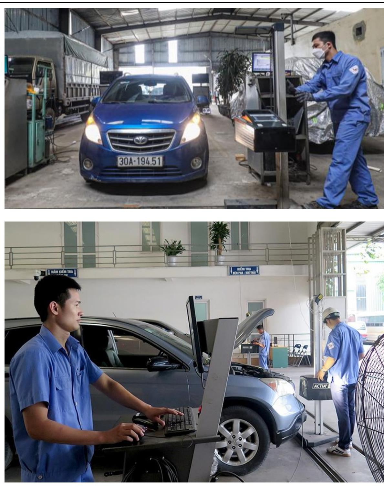

# 1. QUY ĐỊNH KỸ THUẬT ĐỐI VỚI XE CHƯA QUA SỬ DỤNG

# 1.1 Yêu cầu chung

• Xe được sản xuất, lắp ráp từ các linh kiện hoàn toàn mới, lắp đặt chắc chắn, phù hợp với thiết kế, tài liệu kỹ thuật của nhà sản xuất, hoạt động ổn định ở điều kiện bình thường.   
• Xe phải đảm bảo các tính năng kỹ thuật nêu trong tài liệu của nhà sản xuất.   
• Không được rò rỉ các chất lỏng dùng để: làm mát, bôi trơn, dẫn động thủy lực.   
• Có đầy đủ các chi tiết kẹp chặt, phòng lỏng theo tài liệu của nhà sản xuất.   
• Có nhãn hàng hoá (bao gồm cả nhãn phụ) thể hiện các nội dung sau: Tên nhà sản xuất; Nhãn hiệu, tên thương mại (Commercial name), mã kiểu loại (Model code); Số khung (có thể là số PIN hoặc số VIN hoặc số Serial); Thông số kỹ thuật đặc trưng; Năm sản xuất; Thông tin cảnh báo (nếu có). Số khung được đóng trên thân xe hoặc thể hiện trên tem nhãn của nhà sản xuất và các ký tự rõ ràng.   
• Số động cơ được đóng trên thân động cơ hoặc thể hiện trên tem nhãn của nhà sản xuất (có thể là số Serial) và các ký tự rõ ràng.

# 1.2 Động cơ và hệ thống truyền động

1.3 Động cơ

• Lắp đặt chắc chắn. Hoạt động ổn định, không có tiếng kêu lạ. Động cơ không cho phép khởi động khi cần số ở vị trí số tiến hoặc số lùi đối với xe có trang bị hộp số tự động.   
• Bầu giảm thanh và đường ống dẫn khí thải được bố trí để không

ảnh hưởng đến các bộ phận khác.

• Miệng thoát khí thải của ống xả không được hướng về phía trước và không được hướng về phía bên phải theo chiều tiến của xe

# 1.4 Hệ thống truyền động

• Hệ thống truyền động cơ khí   
• Truyền động ma sát trực tiếp: Hoạt động êm dịu, đóng mở dứt khoát, độ chùng của dây đai phải nằm trong giới hạn cho phép của nhà sản xuất. Truyền động ăn khớp trực tiếp: Ăn khớp, hoạt động êm dịu, không bị giật cục.   
. Hệ thống truyền động thuỷ lực   
• Lắp đặt chắc chắn;   
Bơm, mô tơ thuỷ lực, các van thủy lực hoạt động ổn định và không bị kẹt;   
• Đường ống thuỷ lực không bẹp, nứt;   
• Áp suất thể hiện trên đồng hồ nằm trong giới hạn cho phép của nhà sản xuất;

# 1.5 Hệ thống di chuyển

# 1.6 Bánh lốp

• Lắp đặt chắc chắn. Lốp trên cùng một trục của xe phải cùng kiểu loại. Lốp đủ số lượng, khả năng chịu tải của lốp lớn hơn hoặc bằng khối lượng toàn bộ của xe phân bố lên các trục, phù hợp với tài liệu kỹ thuật và thiết kế của nhà sản xuất.   
• Vành bánh xe không bị biến dạng, nứt, vỡ.   
• Moay ơ quay trơn, không bó kẹt, không rò rỉ chất bôi trơn   
• Bánh xích   
• Lắp đặt chắc chắn. • Moay ơ, con lăn tì, con lăn đỡ quay trơn, không bó kẹt, không rò rỉ chất bôi trơn.   
• Xích và bánh xích phải ăn khớp với nhau.   
• Xích phải đảm bảo không trượt ra ngoài khi xe quay vòng tại chỗ. • Bánh thép   
• Lắp đặt chắc chắn.   
• Moay ơ quay trơn, không bó kẹt, không rò rỉ chất bôi trơn.   
• Khi vận hành không có tiếng kêu lạ.

# 1.7 Hệ thống lái và hệ thống điều khiển

• Hệ thống lái Lái bằng vành tay lái   
• Đảm bảo cho xe chuyển hướng chính xác, điều khiển nhẹ nhàng. Đảm bảo cho xe có khả năng duy trì hướng chuyển động thẳng khi đang chạy thẳng và tự quay về hướng chuyển động thẳng khi thôi tác dụng lực lên vành tay lái(1).   
. Khi hoạt động các cơ cấu chuyển động của hệ thống lái không được chạm với bất kỳ bộ phận nào của xe. Khi quay vành tay lái về bên phải và bên trái thì không được có sự khác biệt đáng kể về lực tác động lên vành tay lái.   
• Độ rơ góc của vành tay lái: Không lớn hơn 15 0 (1).   
• Lái bằng cần lái   
. Cần lái lắp đặt chắc chắn, có ký hiệu rõ ràng chiều chuyển hướng của XMCD.   
• Điều khiển nhẹ nhàng, êm dịu, tự trả về vị trí ban đầu khi thôi lực tác dụng.   
Hệ thống điều khiển   
• Hoạt động nhẹ nhàng, êm dịu, không bị kẹt.   
• Được bố trí tại các vị trí dễ dàng và an toàn cho việc thao tác của

người điều khiển.

• Có ký hiệu, biểu tượng nhận biết rõ ràng với từng chức năng điều khiển. • Độ rơ nằm trong giới hạn cho phép của nhà sản xuất. • Lắp đặt chắc chắn, đúng vị trí, đảm bảo chắc chắn khi di chuyển.

# 1.8 Hệ thống phanh

# 1.9 Yêu cầu chung

XMCD phải được trang bị hệ thống phanh (hoặc tự phanh khi đỗ) đảm bảo dừng được xe khi điều khiển dừng.

Hệ thống phanh phải đảm bảo hoạt động đúng tính năng theo tài liệu của nhà sản xuất .

Dầu phanh, khí nén không được rò rỉ; đường ống dẫn dầu phanh hoặc khí nén không bị bẹp, nứt và phải được lắp đặt chắc chắn.

Dẫn động cơ khí của phanh phải linh hoạt, nhẹ nhàng và có hiệu lực. Hành trình tự do của bàn đạp hoặc tay kéo phanh phù hợp với tài liệu của nhà sản xuất.

Hệ thống phanh chính, phanh đỗ, phanh dự phòng có thể sử dụng chung các cơ cấu, bộ phận chức năng và không bắt buộc phải là ba hệ thống riêng biệt, tách rời.

Hệ thống phanh đỗ phải có khả năng duy trì được hoạt động mà không cần có lực tác động liên tục của người lái. Nếu phanh đỗ tham gia vào việc dừng chuyển động của xe thì phanh đỗ phải cho phép thực hiện việc phanh XMCD ngay khi xe đang di chuyển.

Phải đo khoảng cách dừng đối với hệ thống phanh chính và phanh dự phòng khi phanh còn nguội, ngoại trừ xe có hệ thống phanh truyền động thủy tĩnh (hydrostatic brake systems). (2)

Đối với hệ thống phanh của cần trục bánh lốp có vận tốc thiết kế lớn nhất không nhỏ hơn 60 km/h phải thỏa mãn yêu cầu về hệ thống phanh quy định tại mục 2.5 của QCVN 09:2015/BGTVT Quy chuẩn kỹ thuật quốc gia về chất lượng an toàn kỹ thuật và bảo vệ môi trường đối với xe ô tô(1).

# 1.10 Yêu cầu đối với đường thử phanh

Bề mặt đường thử phải cứng, khô, bằng phẳng.

Đường thử để thử xe tự đổ có khối lượng thử lớn hơn 32000 kg phải đáp ứng với phép thử có độ dốc xuống $8 \sim 1 0 \%$ theo hướng di chuyển của xe.

Đường chạy đà để thử phải đảm bảo xe thử đạt được vận tốc quy định trước khi tác động vào hệ thống phanh.

Đường dùng để thử khả năng giữ xe đứng yên có độ dốc phù hợp

Yêu cầu đối với hiệu quả phanh

Hiệu quả phanh của các xe được đánh giá theo chỉ tiêu khoảng cách dừng và thỏa mãn yêu cầu như trong Bảng 1, trừ các loại xe bánh xích có vận tốc thiết kế lớn nhất không lớn hơn 20 km/h.

Vận tốc thử phanh cho phép dung sai trong khoảng ±2 km/h:

Đối với xe tự đổ có khối lượng thử không lớn hơn 32000 kg, thử tại vận tốc $80 \%$ vận tốc di chuyển lớn nhất của xe theo thiết kế hoặc tại vận tốc 32 km/h, nếu vận tốc nào lớn hơn.

Đối với các xe có vận tốc di chuyển lớn nhất theo thiết kế nhỏ hơn 32 km/h, thử tại vận tốc lớn nhất theo tài liệu của nhà sản xuất.

Đối với tất cả các xe còn lại, thử tại vận tốc lớn nhất của hai giá trị sau: $80 \%$ vận tốc di chuyển lớn nhất theo thiết kế của xe, vận tốc 32 km/h.

Thử khoảng cách dừng đối với phanh chính và phanh dự phòng (trừ hệ thống phanh thuỷ lực) được tiến hành khi cơ cấu phanh còn nguội. Phải tiến hành 2 lần thử khi xe di chuyển theo chiều tiến theo hai hướng ngược nhau. Thời gian giữa 2 lần thử tối thiểu là 10 phút.

Khoảng cách dừng đối với phanh chính và phanh dự phòng đối với XMCD sử dụng bánh xe để di chuyển và XMCD bánh xích cao su có vận tốc lớn hơn 20km/h được xác định theo Bảng 1 và là giá trị trung bình của hai lần thử.

Bảng 1 - Khoảng cách dừng của XMCD   

<table><tr><td rowspan=2 colspan=1>Loai phuong tién</td><td rowspan=1 colspan=2>Khoang cach dung toi da</td></tr><tr><td rowspan=1 colspan=1>Phanh chinh</td><td rowspan=1 colspan=1>Phanh phu</td></tr><tr><td rowspan=1 colspan=1>May cap, xe tu d khung cung va xetu dó khung khóp nói có khói luongthu ≤32 000 kg va may tu dä nura romoóc co khói lurong bat ky(*)</td><td rowspan=1 colspan=1>v²44+0,1(32- v)</td><td rowspan=1 colspan=1>v2²30+0,1(32 -v)</td></tr><tr><td rowspan=1 colspan=1>May cap,may xuc lät khung cung vamay xuc lät khung khóp noi voi khóilugng thu &gt;32 000 kg</td><td rowspan=1 colspan=1>v248-2,6a</td><td rowspan=1 colspan=1>v234 -2,6a</td></tr><tr><td rowspan=1 colspan=1>Xe lu cac loai</td><td rowspan=1 colspan=1>v2+0,2(5+v)150</td><td rowspan=1 colspan=1>v275+0,4(5 +v)</td></tr><tr><td rowspan=1 colspan=1>Cac Xe khac, bao góm cac xe kéo romóc có tai</td><td rowspan=1 colspan=1>v2+0,2(5+v)160</td><td rowspan=1 colspan=1>v2+0,4(5+𝑣)80</td></tr><tr><td rowspan=1 colspan=3>v la vän tóc thir (km/h)</td></tr><tr><td rowspan=1 colspan=3>a la do dóc kiém tra (8-10%)</td></tr><tr><td rowspan=1 colspan=3>Chu thich *: Xóa cong thurc 0,1(32-v) doi voi cac xe có tóc d– lón hon 32 km/h</td></tr></table>

Khả năng giữ xe đứng yên ngang dốc của hệ thống phanh chính và phanh đỗ đối với XMCD sử dụng bánh xe để di chuyển và XMCD bánh xích cao su có vận tốc lớn hơn 20km/h thỏa mãn yêu cầu như trong Bảng 2.

# Bảng 2 - Khả năng giữ XMCD đứng yên ngang dốc

<table><tr><td rowspan=1 colspan=1>Loai phanh</td><td rowspan=1 colspan=1>Loai xe</td><td rowspan=1 colspan=1>Do doc(%)</td></tr><tr><td rowspan=4 colspan=1>Phanh chinh</td><td rowspan=1 colspan=1>Xe tur dó có khói luong thur &gt; 32000 kg</td><td rowspan=1 colspan=1>20</td></tr><tr><td rowspan=1 colspan=1>Xe lu cac loai</td><td rowspan=1 colspan=1>20</td></tr><tr><td rowspan=1 colspan=1>Xe tu dó, so&#x27; mi ro&#x27; moóc tu do duoc két hop voi xe kéo có khói luong thu ≤32000 kg</td><td rowspan=1 colspan=1>25</td></tr><tr><td rowspan=1 colspan=1>Tat ca cac xe khac</td><td rowspan=1 colspan=1>25</td></tr><tr><td rowspan=4 colspan=1>Phanh do</td><td rowspan=1 colspan=1> Xe tu dó, xe cap dät durgc két hop voixe keo</td><td rowspan=1 colspan=1>15</td></tr><tr><td rowspan=1 colspan=1> Xe lu cac loai</td><td rowspan=1 colspan=1>20</td></tr><tr><td rowspan=1 colspan=1>So&#x27; mi ro&#x27; mooc tu dó</td><td rowspan=1 colspan=1>20</td></tr><tr><td rowspan=1 colspan=1>Tat cä cac xe khac</td><td rowspan=1 colspan=1>20</td></tr><tr><td rowspan=1 colspan=3>Chu y:1. Khi thur phanh can ngät hé thóng truyén lurc, dong co hoat dong ótrang thaikhong tai hoac dung 2. Khóng áp dung dói voi cac xe có hé thóng phanh truyén dong thuytinh hoac turong tur.</td></tr></table>

