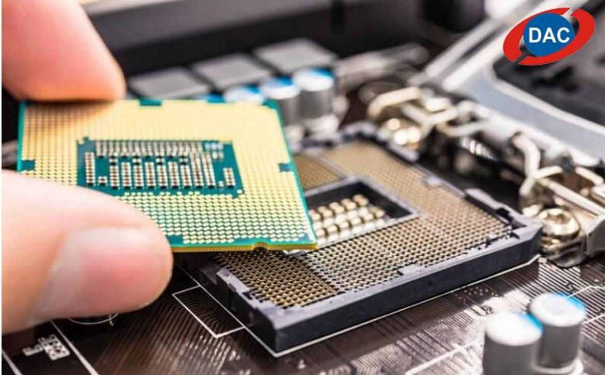
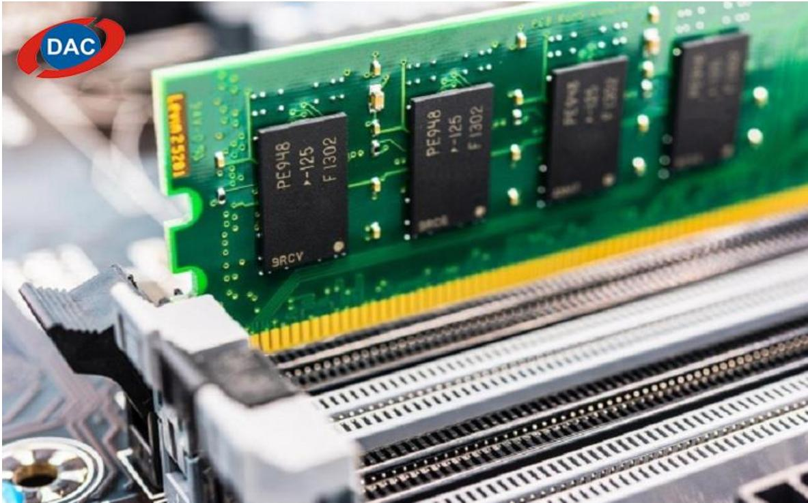
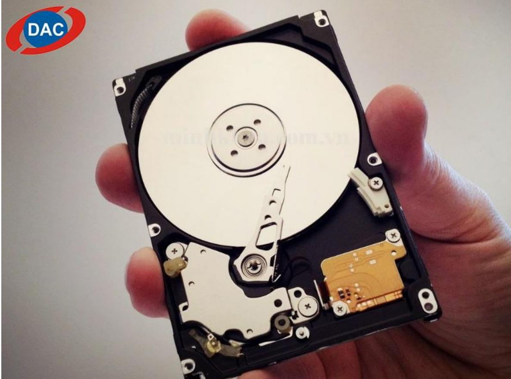
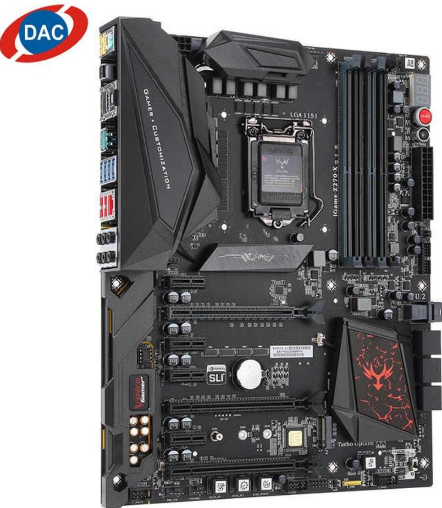

# 1. Tổng quan cấu tạo của một chiếc laptop

Laptop là một thiết bị điện tử được trang bị đầy đủ các phần mềm, hệ thống và ứng dụng cùng nhiều bộ phận khác nhau. Chúng được cấu thành để tạo nên một chiếc laptop hoàn chỉnh.

# 2. Cấu tạo bên ngoài của laptop

Hiện nay, trên thị trường có rất nhiều thương hiệu máy tính có thể kể đến như laptop HP, laptop Dell, Macbook,... Mỗi hãng sẽ có những thiết kế riêng cho sản phẩm của mình, tạo nên sự đa dạng hơn trên thị trường. Cho dù hình dạng của những bộ phận này có sự khác nhau như thế nào đi chăng nữa thì chúng vẫn luôn tồn tại. Cụ thể:

- Vỏ máy: có thể được làm bằng nhựa hoặc kim loại   
- Bàn phím: kiểu dáng đa dạng, có thể có số hoặc không   
- Pin máy: gồm 2 loại chính là pin Lithium-lon (Li-lon) và Lithium Polymer (Lipo) với nhiều dung lượng (3 cell, 4 cell, 6 cell,...)   
- Màn hình: Kích cỡ tùy theo nhu cầu của khách hàng, có từ 10 inch, 11 inch, 13 inch, cho đến 17 inch   
- Touchpad: tùy theo từng nhà sản xuất mà có những dạng khác nhau, nhưng với hai loại chính có nút cơ và không có nút cơ   
- Sạc: Tương ứng với lượng pin mà máy sẽ có sạc bao nhiêu W   
- Các cổng kết nối: cổng USB, Thunderbolt 3, HDMI, LAN, tai nghe,...

# 3. Cấu tạo bên trong của laptop

Đây là phần được quan tâm hơn cả, vì chúng sẽ ảnh hưởng trực tiếp đến quá trình trải nghiệm, sử dụng trên máy của bạn. Không chỉ vậy, nó còn là yếu tố quyết định xem bạn có thể sử dụng được những phần mềm nào, hiệu suất sử dụng ra sao,...

Các bộ phận bên trong gồm có:

- Vi xử lý CPU   
- Card màn hình GPU   
- Bộ nhớ RAM   
- Ổ cứng lưu trữ   
- Vỉ máy tính Mainboard   
- Chip set

4. Chi tiết một số bộ phận quan trọng trong cấu tạo của laptop   
5. Vi xử lý CPU

Đây là một bộ phận quan trọng của laptop, là bộ xử lý phân tích dữ liệu và được gắn trên Mainboard. Các thông tin được CPU xử lý trước sau đó mới xuất hiện trên màn hình laptop của bạn. Laptop của bạn mạnh hay yếu là do CPU. Vì thế mà chúng là linh kiện đắt nhất trong laptop.

  
Vi xử lý CPU

Trên thế giới, có hai hãng chuyên sản xuất CPU nổi tiếng là Intel và AMD:

- Intel: Core 2 duo, core i3, core i5, core i7, core i9,...

- AMD: AMD A6, AMD A8, AMD A10,...

# 6. Card màn hình GPU

GPU là bộ xử lý những tác vụ liên quan đến đồ họa cho vi xử lý CPU.

Card đồ họa VGA là thiết bị giao tiếp giao tiếp giữa màn hình và mainboard, xử lý rồi thông qua màn hình để hiển thị. GPU chính là chip lõi của VGA, quyết định việc chơi game,lập trình, đồ họa trên máy của bạn tốt hay không. Có 2 loại VGA:

- VGA Onboard: loại được tích hợp sẵn trên bo mạch chủ, hoạt động dựa vào CPU và RAM. Phù hợp với các loại máy dành cho văn phòng, lướt web,...

- VGA rời: loại được gắn thêm thông qua PCI, AGP,... trên bo mạch chủ. Thích hợp với các hoạt động chơi game, thiết kế đồ họa nặng, render phim ảnh,...

Hai thương hiệu nổi tiếng về card đồ họa được nhiều người biết đến là AMD và NVIDIA.

# 7. Bộ nhớ RAM

Nơi lưu trữ tạm thời để CPU có thể xử lý nhanh hơn, chúng sẽ biến mất khi bạn restart lại máy. RAM càng lớn thì bạn có thể sử dụng càng nhiều tab, file, ứng dụng mà không bị chậm.

# Ram laptop

Bạn có thể lựa chọn tùy theo nhu cầu sử dụng. Nếu lướt web, xem tin tức thì 4GB đến 8GB là thoải mái. Khi bạn có nhu cầu cao hơn như chơi game, đồ họa, lập trình thì bạn có thể lựa chọn mức 16GB, 32GB.

# 8. Ổ cứng lưu trữ

Chúng sẽ là nơi lưu trữ toàn bộ dữ liệu, hệ điều hành, ứng dụng của bạn. Hiện nay có hai loại ổ cứng thông dụng là SSD và HDD. Trong đó, SSD có tốc độ đọc, xử lý nhanh hơn hẳn so với HDD. Nhưng đồng nghĩa với đó là giác thành của ổ SSD cũng cao hơn so với ổ HDD.

  
Hình dạng của ổ cứng

Dung lượng các ổ cứng này cũng cực đa dạng để đáp ứng nhu cầu lưu trữ của người dùng một cách tốt nhất. Chúng có từ mức 128GB, 256GB, 512GB cho đến 1TB, 2TB.

# 9. Vỉ máy tính Mainboard

Máy tính có hoạt động ổn định hay không, hiệu năng có tốt không đều do Mainboard quyết định. Nó được thiết kế ngay dưới bàn phím, là nơi liên kết các linh kiện thiết bị (RAM, CPU, ổ cứng, card đồ họa,...) lại với nhau thành một khối.

  
Mainboard

# 10. Chip set

Là một bộ các con chip điều khiển mọi hoạt động truyền tải dữ liệu. Chip set được kết nối trực tiếp với CPU và hoạt động như trung gian truyền thông cho RAM, PCI.

Chip set   

<table><tr><td rowspan=1 colspan=1>Hang</td><td rowspan=1 colspan=2>Intel</td><td rowspan=1 colspan=2>AMD</td><td rowspan=1 colspan=1>Apple</td></tr><tr><td rowspan=1 colspan=1>Dongchip</td><td rowspan=1 colspan=1>Corei3/i5/i7/i9</td><td rowspan=1 colspan=1>CoreUltra(MeteorLake)</td><td rowspan=1 colspan=1>Ryzen5/7/9</td><td rowspan=1 colspan=1>Ryzen         AI(Phoenix/HawkPoint)</td><td rowspan=1 colspan=1>AppleM1/M2/M3</td></tr><tr><td rowspan=1 colspan=1>Hieunang</td><td rowspan=1 colspan=1>Ph  thongden cao cap</td><td rowspan=1 colspan=1>T6i  uuAI，hieunang cao</td><td rowspan=1 colspan=1>Danhan manh mé,hieusuattot</td><td rowspan=1 colspan=1> Tich hop NPU,toi uu AI</td><td rowspan=1 colspan=1>Tói uu hieunang va tietkiem pin</td></tr><tr><td rowspan=1 colspan=1>GPUtichhop</td><td rowspan=1 colspan=1>Intel Iris Xe</td><td rowspan=1 colspan=1>Intel ArcGPU</td><td rowspan=1 colspan=1>RadeonGraphics</td><td rowspan=1 colspan=1>RDNA 3 iGPU</td><td rowspan=1 colspan=1>GPU    tichhop  manh(Metal)</td></tr><tr><td rowspan=1 colspan=1>TDP(murc tieu thudien)</td><td rowspan=1 colspan=1>15W        -125W</td><td rowspan=1 colspan=1>15W    -45W</td><td rowspan=1 colspan=1>15W     =65W</td><td rowspan=1 colspan=1>15W - 45W</td><td rowspan=1 colspan=1>10W - 30W</td></tr><tr><td rowspan=1 colspan=1>Ungdungphobien</td><td rowspan=1 colspan=1>Laptop vanphong,gaming,workstation</td><td rowspan=1 colspan=1>LaptopAI，hieunang cao</td><td rowspan=1 colspan=1>Gaming,dhoa,van phong</td><td rowspan=1 colspan=1>Laptop        AI, gaming      tam trung</td><td rowspan=1 colspan=1>MacBookAir,     Pro, Studio</td></tr></table>

  
Bảng so sánh các dòng chip laptop hiện nay