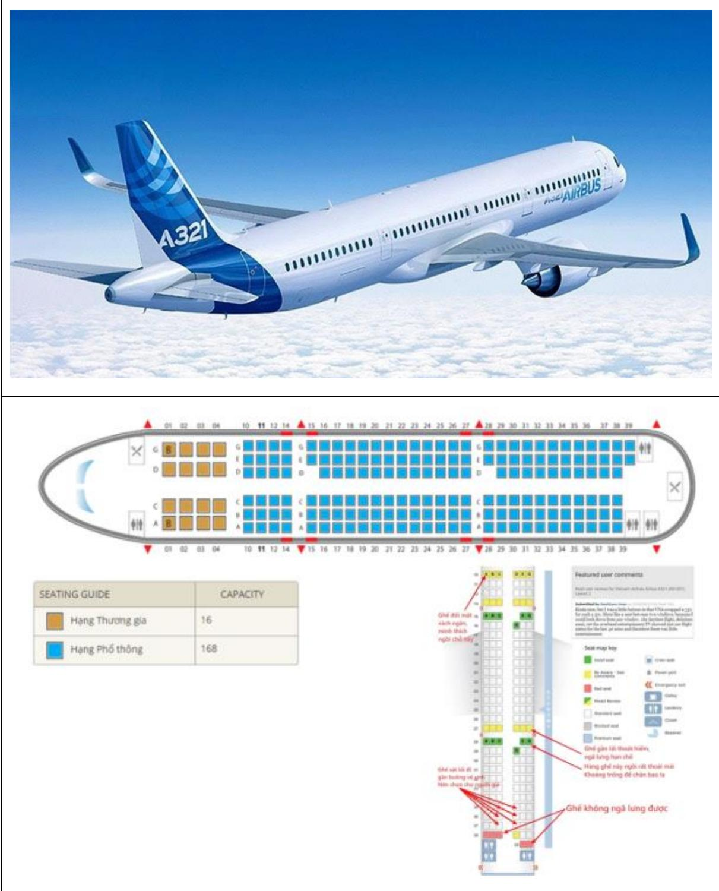
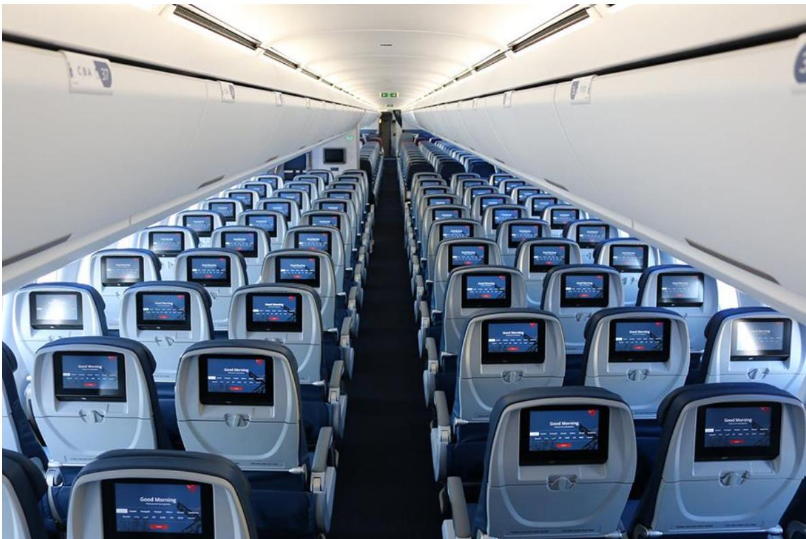

# 1. Thông tin kỹ thuật máy bay Airbus A321

Airbus A321 là dòng máy bay thương mại thân hẹp thuộc gia đình A320 của hãng Airbus. Đây là biến thể lớn nhất của dòng A320, được thiết kế để phục vụ các tuyến bay tầm ngắn và trung bình, với sức chứa hành khách nhiều hơn A320. A321 hiện có nhiều phiên bản như A321ceo, A321neo và A321XLR, mỗi phiên bản đều mang lại những cải tiến về hiệu suất, khả năng tiết kiệm nhiên liệu và tầm bay.

<table><tr><td rowspan=1 colspan=4>Thong só ky thuat chinh cua Airbus A321</td></tr><tr><td rowspan=1 colspan=1>Hang muc</td><td rowspan=1 colspan=1>Thong s6</td><td rowspan=1 colspan=1>Don vi</td><td rowspan=1 colspan=1>Ghi chu</td></tr><tr><td rowspan=1 colspan=1>Chieu dai</td><td rowspan=1 colspan=1>44,51</td><td rowspan=1 colspan=1>m</td><td rowspan=1 colspan=1>Dai hon A320</td></tr><tr><td rowspan=1 colspan=1>Sai canh</td><td rowspan=1 colspan=1>35,8</td><td rowspan=1 colspan=1>m</td><td rowspan=1 colspan=1>C6 sharklets tanghieu suat</td></tr><tr><td rowspan=1 colspan=1>Chiéu cao</td><td rowspan=1 colspan=1>11,76</td><td rowspan=1 colspan=1>m</td><td rowspan=1 colspan=1></td></tr><tr><td rowspan=1 colspan=1>Suc chua hanhkhach</td><td rowspan=1 colspan=1>185 - 236</td><td rowspan=1 colspan=1>nguoi</td><td rowspan=1 colspan=1>Tuy cau hinh</td></tr><tr><td rowspan=1 colspan=1>Tam bay</td><td rowspan=1 colspan=1>5.950 - 7.400</td><td rowspan=1 colspan=1>km</td><td rowspan=1 colspan=1>Tuy phien banA321neo/A321XLR</td></tr></table>

# 2. Thiết kế tổng thể

A321 được phát triển dựa trên khung của A320 nhưng kéo dài phần thân để tăng sức chứa hành khách. Máy bay sử dụng cấu hình cánh gắn thấp, hai động cơ phản lực treo dưới cánh, giúp tối ưu hiệu suất bay. Buồng lái được tiêu chuẩn hóa với các thành viên trong dòng A320, giúp giảm chi phí đào tạo phi công.

# 3. Động cơ

Airbus A321 có thể trang bị nhiều loại động cơ khác nhau tùy theo phiên bản. A321ceo sử dụng động cơ CFM56 hoặc IAE V2500, trong khi A321neo được trang bị thế hệ động cơ mới như Pratt & Whitney PW1100G hoặc CFM LEAP-1A, giúp tiết kiệm nhiên liệu hơn $1 5 - 2 0 \%$ . A321XLR với động cơ tối ưu hóa, kết hợp thùng nhiên liệu bổ sung, cho phép bay đường dài lên tới $8 . 7 0 0 \mathrm { k m }$ .

# 4. $\mathbf { H } \hat { \mathbf { e } }$ thống điện tử và điều khiển bay

A321 được trang bị hệ thống điều khiển bay fly-by-wire tiên tiến, giúp tăng cường độ an toàn và giảm tải cho phi công. Buồng lái sử dụng màn hình kỹ thuật số hiện đại, bố trí trực quan và thân thiện, giúp phi công dễ dàng kiểm soát và vận hành máy bay trong nhiều điều kiện bay khác nhau.

# 5. Hiệu suất khai thác

A321 là lựa chọn phổ biến của nhiều hãng hàng không cho các tuyến bay có nhu cầu vận chuyển cao. Máy bay vừa đảm bảo chi phí khai thác thấp nhờ động cơ tiết kiệm nhiên liệu, vừa đáp ứng nhu cầu hành khách nhờ khoang rộng rãi. Phiên bản A321neo đặc biệt phù hợp cho các hãng hàng không giá rẻ, trong khi A321XLR giúp mở rộng khả năng bay xuyên lục địa.

# 6. Thông số vận hành bổ sung

Tốc độ hành trình: Mach 0,78 (khoảng $8 2 8 \ \mathrm { k m / h } )$ Trần bay: $1 2 . 0 0 0 \mathrm { ~ m ~ }$ Trọng lượng cất cánh tối đa (MTOW): $8 9 . 0 0 0 - 1 0 1 . 0 0 0 \mathrm { k g }$ (tùy phiên bản) Dung tích nhiên liệu: khoảng 23.000 – 32.900 lít Chi phí vận hành thấp hơn $20 \%$ so với các máy bay cùng phân khúc nhờ công nghệ tiên tiến.

# 7. Sự phát triển và ứng dụng

$\mathrm { K } \mathring { \mathbf e }$ từ khi ra mắt, Airbus A321 đã trở thành một trong những máy bay thân hẹp bán chạy nhất thế giới. Nhiều hãng hàng không lớn như American Airlines, Lufthansa, VietJet Air, Vietnam Airlines đều khai thác A321. Với phiên bản A321XLR, Airbus kỳ vọng có thể thay thế một phần các dòng máy bay thân rộng trong các đường bay quốc tế trung bình.

# 8. Kết luận

Airbus A321 là dòng máy bay quan trọng trong ngành hàng không thương mại hiện nay. Với thiết kế hiện đại, hiệu suất vượt trội và chi phí khai thác hợp lý, A321 đã trở thành lựa chọn hàng đầu của nhiều hãng hàng không trên thế giới.

