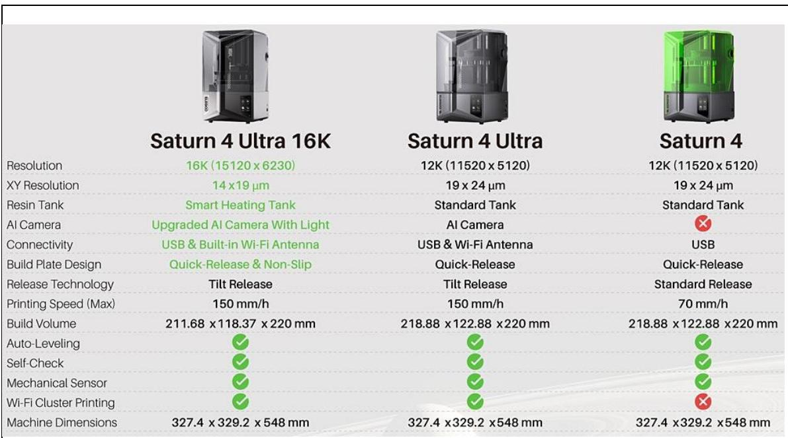

Elegoo Saturn 4 Ultra 4 Nhựa Ultra 16K máy in thiết lập một chuẩn mực mới cho nhựa in 3D. Được biết đến với độ chính xác, tốc độ và hiệu suất hàng đầu, Elegoo Saturn 4 Ultra 4 Nhựa Ultra 16K Máy in được thiết kế để đáp ứng nhu cầu của cả người dùng chuyên nghiệp và những người đam mê. Cho dù bạn đang tạo ra các nguyên mẫu chi tiết, mô hình phức tạp hay thiết kế sáng tạo, Elegoo Saturn 4 Ultra 4 Nhựa Ultra 16K cung cấp độ phân giải và hiệu quả vượt trội cần thiết để tạo ra bản in chất lượng cao nhất.

# 1. Là gì Elegoo Saturn 4 Ultra Máy in nhựa 4 Ultra 16K?

Elegoo Saturn 4 Ultra Nhựa 4 Ultra 16K là sự bổ sung mới nhất cho loại nhựa nổi tiếng Saturn loạt bởi Elegoo, một công ty được công nhận là cung cấp các giải pháp in 3D chất lượng cao và giá cả phải chăng. Saturn 4 Ultra được trang bị 16K monoMàn hình LCD mạ crôm, khiến nó trở thành một trong những máy in 3D nhựa tiên tiến nhất hiện có trên thị trường. Với độ phân giải $1 6 , 3 8 4 \mathrm { ~ x ~ } 9 , 2 1 6$ pixel, Elegoo Saturn 4 Ultra Máy in nhựa 4 Ultra 16K cung cấp độ chi tiết đáng kinh ngạc, đảm bảo bản in của bạn có độ chính xác và rõ nét cao.

Một đặc điểm nổi bật của Elegoo Saturn 4 Ultra Máy in nhựa 4 Ultra 16K có khối lượng xây dựng lớn hơn so với trước đây Saturn các mô hình, giúp nó có khả năng xử lý các mô hình lớn hơn hoặc nhiều bản in nhỏ hơn cùng lúc. monoMàn hình LCD mạ crôm tăng cường cả tốc độ và độ bền, đảm bảo bạn tận dụng tối đa các dự án in 3D của mình.

# 2. Elegoo Saturn 4 Ultra 4 thông số in 16D bằng nhựa Ultra 3K:

<table><tr><td colspan="1" rowspan="1">Nhura</td><td colspan="1" rowspan="1">D@ day lopphoi</td><td colspan="1" rowspan="1">Thoi  giansang(giay)</td><td colspan="1" rowspan="1">Lop    coso/lopchuyentiep</td><td colspan="1" rowspan="1">Tiépxuclop co so</td><td colspan="1" rowspan="1">Toc do</td><td colspan="1" rowspan="1">Ché  docho</td><td colspan="1" rowspan="1">Thoi   giannghi    mibuoc (giay)</td></tr><tr><td colspan="1" rowspan="2">Deep Blue</td><td colspan="1" rowspan="1">100 μm</td><td colspan="1" rowspan="1">n/a</td><td colspan="1" rowspan="1"></td><td colspan="1" rowspan="1"></td><td colspan="1" rowspan="1"></td><td colspan="1" rowspan="1"></td><td colspan="1" rowspan="1"></td></tr><tr><td colspan="1" rowspan="1">50 μm</td><td colspan="1" rowspan="1">n/a</td><td colspan="1" rowspan="1"></td><td colspan="1" rowspan="1"></td><td colspan="1" rowspan="1"></td><td colspan="1" rowspan="1"></td><td colspan="1" rowspan="1"></td></tr><tr><td colspan="1" rowspan="2">Stone   CoalBlack</td><td colspan="1" rowspan="1">100 μm</td><td colspan="1" rowspan="1">n/a</td><td colspan="1" rowspan="1"></td><td colspan="1" rowspan="1"></td><td colspan="1" rowspan="1"></td><td colspan="1" rowspan="1"></td><td colspan="1" rowspan="1"></td></tr><tr><td colspan="1" rowspan="1">50 μm</td><td colspan="1" rowspan="1">6,5</td><td colspan="1" rowspan="1">2/15</td><td colspan="1" rowspan="1">40</td><td colspan="1" rowspan="1">NHANHCHONG</td><td colspan="1" rowspan="1">Gio nghi</td><td colspan="1" rowspan="1">2,0/0/0,5</td></tr><tr><td colspan="1" rowspan="2">Bio-MedClear</td><td colspan="1" rowspan="1">100 μm</td><td colspan="1" rowspan="1">n/a</td><td colspan="1" rowspan="1"></td><td colspan="1" rowspan="1"></td><td colspan="1" rowspan="1"></td><td colspan="1" rowspan="1"></td><td colspan="1" rowspan="1"></td></tr><tr><td colspan="1" rowspan="1">50 μm</td><td colspan="1" rowspan="1">5,0</td><td colspan="1" rowspan="1">2/15</td><td colspan="1" rowspan="1">40</td><td colspan="1" rowspan="1">NHANHCHONG</td><td colspan="1" rowspan="1">Gio nghi</td><td colspan="1" rowspan="1">2,0/0/0,5</td></tr><tr><td colspan="1" rowspan="2">Tough-X</td><td colspan="1" rowspan="1">100 μm</td><td colspan="1" rowspan="1">15.0</td><td colspan="1" rowspan="1">2/15</td><td colspan="1" rowspan="1">40</td><td colspan="1" rowspan="1">Cham</td><td colspan="1" rowspan="1">Gio nghi</td><td colspan="1" rowspan="1">2,0/0/0,5</td></tr><tr><td colspan="1" rowspan="1">50 um</td><td colspan="1" rowspan="1">n/a</td><td colspan="1" rowspan="1"></td><td colspan="1" rowspan="1"></td><td colspan="1" rowspan="1"></td><td colspan="1" rowspan="1"></td><td colspan="1" rowspan="1"></td></tr><tr><td colspan="1" rowspan="2">Flexible-X</td><td colspan="1" rowspan="1">100 μm</td><td colspan="1" rowspan="1">n/a</td><td colspan="1" rowspan="1"></td><td colspan="1" rowspan="1"></td><td colspan="1" rowspan="1"></td><td colspan="1" rowspan="1"></td><td colspan="1" rowspan="1"></td></tr><tr><td colspan="1" rowspan="1">50 μm</td><td colspan="1" rowspan="1">12.0</td><td colspan="1" rowspan="1">2/15</td><td colspan="1" rowspan="1">50</td><td colspan="1" rowspan="1">Cham</td><td colspan="1" rowspan="1">Gio nghi</td><td colspan="1" rowspan="1">2,0/0/0,5</td></tr><tr><td colspan="1" rowspan="2">Elastomer-X</td><td colspan="1" rowspan="1">100 μm</td><td colspan="1" rowspan="1">16,0</td><td colspan="1" rowspan="1">2/20</td><td colspan="1" rowspan="1">60</td><td colspan="1" rowspan="1">Cham</td><td colspan="1" rowspan="1">Gio nghi</td><td colspan="1" rowspan="1">2,0/0/0,5</td></tr><tr><td colspan="1" rowspan="1">|50 μm</td><td colspan="1" rowspan="1">n/a</td><td colspan="1" rowspan="1"></td><td colspan="1" rowspan="1"></td><td colspan="1" rowspan="1"></td><td colspan="1" rowspan="1"></td><td colspan="1" rowspan="1"></td></tr></table>

\* Tough-X, Flexible-X và Premium flex yêu cầu hỗ trợ nặng, Elastomer-X đòi hỏi hỗ trợ cực kỳ nặng.

# 3. Các tính năng chính của Elegoo Saturn 4 Ultra Máy in nhựa 4 Ultra 16K

# 3.1 Độ phân giải và chi tiết vô song

Sức mạnh cốt lõi của Elegoo Saturn 4 Ultra Máy in nhựa 4 Ultra 16K nằm ở 16K monoMàn hình LCD mạ crôm. Màn hình tiên tiến này mang lại độ phân giải và độ sắc nét vượt trội, cho phép tạo ra các bản in có độ chi tiết cao, ngay cả đối với những chi tiết phức tạp nhất. Độ phân giải 16K mang lại bề mặt mịn màng hơn và chi tiết sắc nét hơn so với các máy in có độ phân giải thấp hơn, hoàn hảo cho các thiết kế nhỏ và phức tạp như mô hình thu nhỏ, trang sức và các bộ phận cơ khí. Với Elegoo Saturn 4 Ultra Với nhựa Ultra 4K, bạn có thể tự tin in các vật thể có độ phân giải cao đòi hỏi sự chú ý cực kỳ tỉ mỉ đến từng chi tiết, đảm bảo rằng ngay cả những đặc điểm nhỏ nhất cũng được ghi lại một cách chính xác.

# 3.2 Khối lượng xây dựng mở rộng

Elegoo Saturn 4 Ultra Máy in nhựa resin 4 Ultra 16K có thể tích in ấn tượng 218 $\textrm { x } 1 2 3 \textrm { x } 2 5 0 \mathrm { m m }$ , cung cấp không gian rộng rãi cho cả bản in khổ lớn và bản in nhiều chi tiết. Thể tích in mở rộng này cho phép người dùng thực hiện các dự án quan trọng hơn mà không cần phải thu nhỏ hoặc in riêng từng chi tiết. Đối với các chuyên gia trong các lĩnh vực như tạo mẫu, thiết kế sản phẩm và giáo dục, diện tích in lớn hơn đồng nghĩa với việc cần ít lệnh in hơn để hoàn thành một dự án, tiết kiệm thời gian và nâng cao hiệu quả tổng thể.

# 3.3 Thời gian đóng rắn nhanh hơn với Monomàn hình LCD mạ crôm

Một trong những lợi thế đáng $\mathrm { k } \mathring { \mathrm { e } }$ của Elegoo Saturn 4 Ultra Máy in nhựa 4 Ultra 16K là monoMàn hình LCD mạ crôm. monoMàn hình crôm sử dụng nguồn sáng hiệu quả hơn, cho phép thời gian xử lý nhanh hơn trong quá trình in. Quá trình xử lý nhanh hơn này không chỉ rút ngắn tổng thời gian in mà còn tăng tuổi thọ của màn hình LCD, nhờ hiệu suất năng lượng cao hơn. Thời gian xử lý được cải thiện cũng mang lại kết quả in đồng đều hơn trên các bản in, đảm bảo độ hoàn thiện mịn màng hơn và giảm thiểu nguy cơ xảy ra các sự cố như lệch lớp.

# 3.4 Tăng cường độ ổn định và độ bền

Elegoo Saturn 4 Ultra Máy in nhựa 4 Ultra 16K được thiết kế với cấu trúc chắc chắn và ổn định để giảm thiểu rung động trong quá trình in. Độ ổn định là yếu tố thiết yếu cho in ấn độ phân giải cao, nơi ngay cả chuyển động nhỏ nhất cũng có thể ảnh hưởng đến chất lượng bản in. Elegoo Saturn 4 Ultra Nhựa in 4 Ultra 16K đảm bảo kết quả in luôn chính xác và đồng nhất, ngay cả khi in trong thời gian dài. Máy in cũng được trang bị hệ thống dẫn hướng tuyến tính trục Z tiên tiến, giúp duy trì chuyển động mượt mà trong quá trình in, ngăn ngừa hiện tượng lệch hoặc rung lắc trong quá trình in lớp. Điều này giúp nâng cao chất lượng in tổng thể, đặc biệt là đối với các mô hình lớn hoặc chi tiết.

# 3.5 Giao diện thân thiện với người dùng

Với giao diện màn hình cảm ứng lớn 4.3 inch, Elegoo Saturn 4 Ultra Máy in nhựa 4 Ultra 16K giúp việc điều khiển in 3D của bạn trở nên đơn giản và trực quan. Giao diện dễ điều hướng cho phép người dùng điều chỉnh cài đặt, theo dõi tiến độ và quản lý công việc in nhanh chóng và hiệu quả. Dù bạn là người mới bắt đầu hay chuyên gia, Elegoo Saturn 4 Ultra Nhựa in 4 Ultra 16K mang đến trải nghiệm người dùng liền mạch. Giao diện cho phép bạn điều chỉnh các cài đặt in quan trọng, chẳng hạn như thời gian phơi sáng, chiều cao lớp và tốc độ, để bạn có thể tinh chỉnh hiệu suất của máy in. Elegoo Saturn 4 Ultra Máy in nhựa Ultra 4K phù hợp với loại nhựa cụ thể mà bạn đang sử dụng.

# 3.6 Khả năng tương thích với nhiều loại nhựa khác nhau

Elegoo Saturn 4 Ultra Máy in nhựa 4 Ultra 16K cực kỳ linh hoạt, tương thích với nhiều loại vật liệu nhựa. Tính linh hoạt này cho phép bạn thử nghiệm với nhiều loại nhựa khác nhau, dù bạn đang sử dụng nhựa tiêu chuẩn cho bản in thông thường, nhựa chịu nhiệt độ cao cho nguyên mẫu kỹ thuật hay nhựa dẻo để tạo mô hình cần độ đàn hồi nhỏ. Ngoài các loại nhựa tiêu chuẩn, Elegoo Saturn 4 Ultra Máy in nhựa 4 Ultra 16K hoạt động với nhiều loại Liqcreate nhựa, mang lại kết quả tốt hơn cho những ai tìm kiếm bản in chất lượng. Cho dù bạn đang thực hiện một dự án đơn lẻ hay một lô bản in lớn, bạn có thể tin tưởng vào Elegoo Saturn 4 Ultra 4 Nhựa Ultra 16K mang lại kết quả đồng nhất và chất lượng cao.

4. Các ứng dụng của Elegoo Saturn 4 Ultra Máy in nhựa 4 Ultra 16K

Elegoo Saturn 4 Ultra Máy in nhựa 4 Ultra 16K phù hợp với nhiều ứng dụng khác nhau, bao gồm:

# 5. Nguyên mẫu và Thiết kế sản phẩm

Đối với các nhà thiết kế và kỹ sư, Elegoo Saturn 4 Ultra Máy in nhựa 4 Ultra 16K cung cấp khả năng tạo mẫu nhanh chóng các ý tưởng hoặc khái niệm mới. Độ phân giải cao đảm bảo các mẫu được tạo ra với các chi tiết phức tạp, cho phép đánh giá kỹ lưỡng hơn trước khi chuyển sang giai đoạn sản xuất. Cho dù bạn đang thử nghiệm một bộ phận cơ khí hay đánh giá một thiết kế thẩm mỹ, Elegoo Saturn 4 Ultra Máy in nhựa 4 Ultra 16K cho phép lặp lại nhanh chóng và tạo ra các mô hình chính xác.

# 6. In ấn tượng nhỏ và tượng nhỏ

Những người đam mê và sáng tạo thích làm mô hình thu nhỏ trò chơi trên bàn, tượng nhỏ hoặc đồ sưu tầm sẽ tìm thấy Elegoo Saturn 4 Ultra Máy in nhựa 4 Ultra 16K là một công cụ tuyệt vời. Độ phân giải cực cao của máy in giúp ghi lại ngay cả những chi tiết nhỏ nhất, chẳng hạn như đặc điểm khuôn mặt, kết cấu và phụ kiện phức tạp, đảm bảo kết quả cuối cùng thật ấn tượng về mặt thị giác.

# 7. Thiết kế trang sức

Đối với thợ kim hoàn, Elegoo Saturn 4 Ultra Nhựa 4 Ultra 16K là lựa chọn lý tưởng. Độ chi tiết tinh xảo mà nó có thể nắm bắt được khiến nó trở nên hoàn hảo để tạo khuôn, thiết $\mathrm { k } \acute { \mathrm { e } }$ trang sức tùy chỉnh và nguyên mẫu. Elegoo Saturn 4 Ultra Máy in nhựa 4 Ultra 16K giúp thợ kim hoàn nhanh chóng hiện thực hóa các thiết $\mathrm { k } \acute { \mathrm { e } }$ của mình, với độ chính xác cần thiết để tạo ra những sản phẩm nhỏ, có độ chi tiết cao.

# 8. Giáo dục và nghiên cứu về in 3D bằng nhựa

Trong các bối cảnh giáo dục, Elegoo Saturn 4 Ultra Máy in nhựa 4 Ultra 16K có thể được sử dụng để tạo mô hình cho mục đích giảng dạy, nghiên cứu và thí nghiệm. Khối lượng in lớn và độ phân giải cao cung cấp không gian rộng rãi để in nhiều loại vật thể khác nhau cho các lĩnh vực khác nhau, từ mô hình sinh học đến nguyên mẫu kiến trúc.