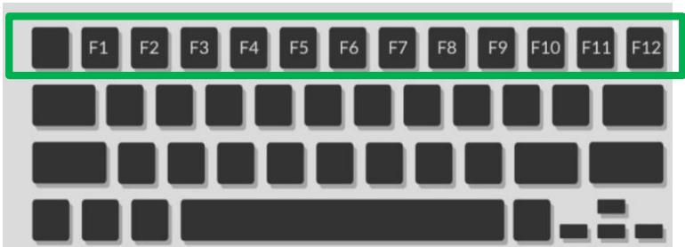
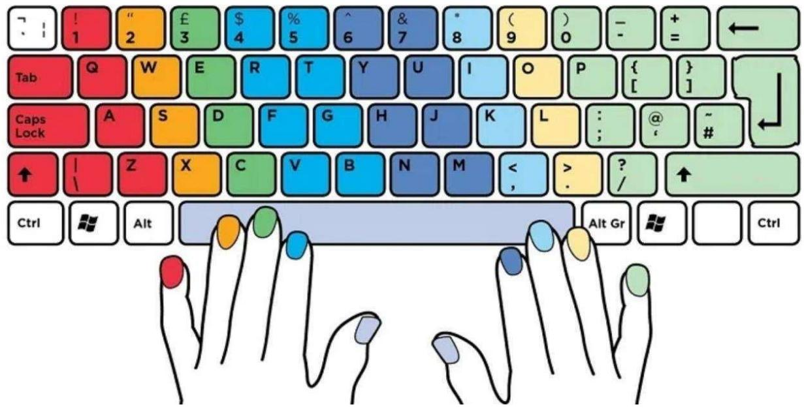

# 1. PHÍM CHỨC NĂNG CỦA MÁY TÍNH

Tùy thuộc vào loại máy tính để bàn hoặc máy tính xách tay mà bạn có, bàn phím thông thường được thiết kế phù hợp để tương tác với hệ điều hành Windows (như Dell, HP, Acer, Asus và Microsoft) hoặc hệ điều hành MacOS (như iMac và Macbook). Nếu không chắc chắn về loại bàn phím của mình, hãy nhìn vào phím ở bên trái của Thanh dấu cách (Spacebar - Thanh dài nhất trên bàn phím).

<table><tr><td>Alt</td><td colspan="3">Néu phim hién thi chu Alt, thi duong nhu quy vi c6mót banphim</td></tr><tr><td></td><td colspan="3">commai Windows Phim Windows thuong nam duoi cung bén trai</td></tr><tr><td></td><td colspan="3">duoi cung bén trai 80 8 8</td></tr><tr><td>GOO0GOOOO P10 0：5 8</td><td colspan="3">品 800 日 H 4 5 6 5 8 。 @ 0 W E R T &quot;u 。 P A s D F G H K L 会 Z + C V B N M &lt; X 北</td></tr></table>

Các phím chức năng được sử dụng để thực hiện các tác vụ cụ thể, được ghi trên bàn phím là F1, F2, F3, …. Chức năng các phím này khác nhau giữa các hệ điều hành, giữa các loại máy. Thông thường các phím này thường được thiết kế trên cùng của bàn phím.

<table><tr><td colspan="2" rowspan="1">Phim</td><td colspan="1" rowspan="1">Mo ta</td><td colspan="2" rowspan="1">Phim</td><td colspan="1" rowspan="1">Mo ta</td></tr><tr><td colspan="2" rowspan="1">F1</td><td colspan="1" rowspan="1">Mo man hinh Tro giup</td><td colspan="2" rowspan="1">F7</td><td colspan="1" rowspan="1">Kiém tra chinh ta va ngurphap cua tai lieu trongMicrosoft Apps (vi du:Word</td></tr><tr><td colspan="2" rowspan="1">F2</td><td colspan="1" rowspan="1">Sura tén tép hoäc thu mucda chon</td><td colspan="2" rowspan="1">F8</td><td colspan="1" rowspan="1">Nhän phim F8 ngay khilaptop vira khoi dong dékhoi dong laptop ó ché doSafe Mode.</td></tr><tr><td colspan="1" rowspan="1">F3</td><td colspan="1" rowspan="1"></td><td colspan="1" rowspan="1">Mo tinh näng tim kiém chomot ung dung dang hoatdong tai thoi diém hien tai</td><td colspan="1" rowspan="1">F9</td><td colspan="1" rowspan="1"></td><td colspan="1" rowspan="1">Lam moi tai lieu trongMicrosoft Word va gui vanhan email trong Outlook</td></tr><tr><td colspan="2" rowspan="2">F4F5</td><td colspan="1" rowspan="1">Mo thanh dia chi trénWindowsExplorervaInternet Explorer.</td><td colspan="2" rowspan="1">F10</td><td colspan="1" rowspan="1">Kich hoat thanh menu cuaung dung dang mo</td></tr><tr><td colspan="1" rowspan="1">Lam moi hoac tai lai tranghoäc cira s tai lieu</td><td colspan="2" rowspan="1">F11</td><td colspan="1" rowspan="1">Sur dung phim F11 dé móché d@ toan man hinh tréncac trinh duyét phó bién(IE, Firefox, GoogleChrome...).</td></tr><tr><td>F6</td><td>Di chuyén con tró dén thanh dia chi trong hau hét cac trinh duyét Internet</td><td>F12</td><td colspan="3">Mo h@p thoai Luu duoi dangtrongMicrosoft Word. Mo chirc näng xem ma nguon website tren bät ky trinh duyet nao.</td></tr></table>

# 2. CÁC PHÍM CHỮ CÁI

Các chữ cái không theo thứ tự bảng chữ cái. Bố cục bàn phím phổ biến nhất được gọi là bàn phím QWERTY, do sáu chữ cái đầu tiên xuất hiện từ phía trên bên trái.

Để gõ được 10 ngón thì đầu tiên là bạn cần phải ghi nhớ được vị trí đặt ngón tay trên bàn phím cũng như nhiệm vụ của từng ngón. Ngón trỏ tay trái đặt ở phím F, Ngón trỏ tay phải đặt ở phím J.

# 3. CÁC PHÍM THÔNG DỤNG KHÁC

<table><tr><td colspan="1" rowspan="1"> STT</td><td colspan="1" rowspan="1">Phim</td><td colspan="1" rowspan="1">Mo ta</td></tr><tr><td colspan="1" rowspan="2">1</td><td colspan="1" rowspan="2">Esc</td><td colspan="1" rowspan="1">Phim Esc (viét tät cua tir escape) có tac dung dung(stop) hoäc thoat (quit) m@t chuong trinh hoac hoatdong.</td></tr><tr><td colspan="1" rowspan="1">Phim Esc cung giup dóng cac menu chuot phai vacó thé dung dé loai bö mt só hóp bat lén</td></tr><tr><td colspan="1" rowspan="2">2</td><td colspan="1" rowspan="2">Tab</td><td colspan="1" rowspan="1">Phim Tab dé di chuyén con tro dén truong tiéptheo trén m@t biéu mäu.</td></tr><tr><td colspan="1" rowspan="1">Hoäc cho phép ban thut lé van ban khi go van ban</td></tr><tr><td colspan="1" rowspan="2">3</td><td colspan="1" rowspan="2">Caps Lock</td><td colspan="1" rowspan="1">Phim Caps Lock cho phép quy vi goö cac chu cäi INHOA (UPPERCASE).</td></tr><tr><td colspan="1" rowspan="1">Nhan phim nay mot lan dé bät dau sur dung chu viéthoa va mot lan nua dé quay lai chu thuong.</td></tr><tr><td colspan="1" rowspan="1">4</td><td colspan="2" rowspan="1">Di chuyén xuóng xa hon vé phia tay trai chung taShift                         tim thay phim Shift. Néu nhan cung m@t luc phimShift va mt phim chu cai, có thé bién chur cai d6thanh mot chu in hoa.Néu nhan phim Shift va m@t trong cac phim só ótren cung ban phim, quy vi có thé gö ky hiéu xuathien bén canh só d6. Vi du- Shift + 2 sé cho phép ban go @- Shift + 5 sé cho phép ban go %.</td></tr><tr><td colspan="2" rowspan="1">5Delete</td><td colspan="1" rowspan="1">Phim Delete (hay Del) cho phép xóa ky tu (chu, s6,khoang tróng hoac ky tur, tap tin) duoc chon.Ngoai ra, phim Delete con có mót só churc nängkhac nhu:- Khoi dong lai may tinh: Nhan va gitr Delete khikhoi dong may tinh c6 thé truy cäp vao BIOS hoac menu khoi dong.- X6a dur lieu khoi ó cung: Mot só chuong trinh chophép ban sir dung Delete dé xóa dur lieu khoi ó cungmot cach an toan.- Thuc hién cac phim tät: Mot só phim tät yéu caunhán Delete két hop voi cac phim khac.</td></tr><tr><td colspan="1" rowspan="1">6</td><td colspan="1" rowspan="1">Backspace</td><td colspan="1" rowspan="1">Phim Backspace cho phép xóa ky tur (chu, só,khoang tróng hoac ky tu cuoi cung ） ó bén trai cuaduong thang durng nhap nhay, hay con tró, tren manhinh may tinh.</td></tr><tr><td colspan="1" rowspan="1">7</td><td colspan="1" rowspan="1">Enter</td><td colspan="1" rowspan="1">Phim Enter hoäc Return dé bät dau mot dong moikhi ban dang gö mot tai lieu hoac bät dau tim kiémkhi duyét trang mang (trong truong hop duyét trang web, ban có thé́ sur dung nó thay con chu@t dé nhännut Tim kiém (Search) trén man hinh may tinh)</td></tr><tr><td colspan="3" rowspan="1">8                                              Cac phim mui ten (arrow) giup di chuyén xungquanh va diéu huong.Ban có thé sir dung cac phim mui ten dé di chuyéncon tro duong thang dung nhap nhay tren mot tai</td></tr><tr><td></td><td></td><td>liéu khi go. Sir dung cac mui tén dé di len va xuong giua cac dong van ban hoäc sang trai va phai giua cac ky tur trong mot cau. ó duoi cung ban phim la Thanh dau cäch</td></tr><tr><td></td><td></td><td>(Spacebar). Phim nay có thé́ khóng có bat cur chu cai hoäc só nao trén dó hoäc có chu “Space", day la phim dai nhat tren ban phim (vi cä hai ngón tay cai déu phai dat trén phim cach), thuong ó duoi cung cua ban phim. Thanh dau cach cho phép tao mót khoang tróng ó bén phai cua con tró duong thang dung nhap nhay trén man hinh khi ban dang soan thao van ban dé tao khoang trong giua cac tir.</td></tr></table>

Lưu ý: Windows có một công cụ Trợ năng tích hợp sẵn có tên là Bàn phím ảo (OSK) có thể được sử dụng thay cho bàn phím vật lý.

Bạn không nhất thiết phải sử dụng màn hình cảm ứng để sử dụng OSK. OSK được thiết kể để hiển thị trực quan với tất cả các phím chuẩn, bạn có thể sử dụng chuột máy tính để chọn phím. Nếu máy tính bạn có màn hình cảm ứng thì chắc chắn bạn có thể dùng bàn phím cảm ứng. Bàn phím cảm ứng sẽ xuất hiện khi bạn chạm vào hộp văn bản khi PC của bạn ở chế độ máy tính bảng. Để mở Bàn phím ảo trên màn hình:

- Di chuyển chuột đến Bắt đầu (Starts), chọn Cài đặt (Settings)   
- Chọn Tiếp cận (Accessibility)   
Chọn Bàn phím (Keyboard)   
- Tại mục Bàn phím ảo (On-Screen Keyboard), trượt sang chế độ Bật (On) hoặc

ấn đồng thời các phím Windows $^ +$ Ctrl + O

Một bàn phím có thể được sử dụng để di chuyển xung quanh màn hình và nhập văn bản sẽ xuất hiện trên màn hình. Bàn phím sẽ vẫn ở trên màn hình cho đến khi bạn đóng nó lại.