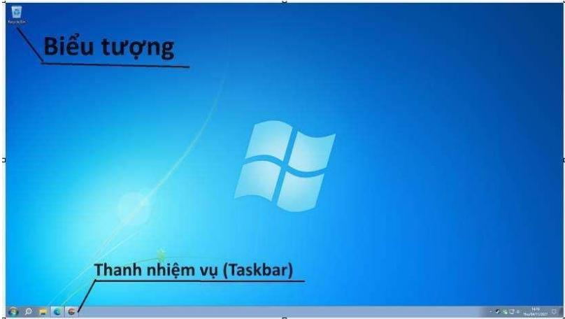

# 1. CÁC PHIÊN BẢN HỆ ĐIỀU HÀNH WINDOWS

<table><tr><td colspan="1" rowspan="1">STT</td><td colspan="1" rowspan="1">He dieu hanh</td><td colspan="1" rowspan="1">Tén hé dieu hanh</td></tr><tr><td colspan="1" rowspan="1">1</td><td colspan="1" rowspan="3">8WINDOWS</td><td colspan="1" rowspan="1">Windows 1.0 (1985)</td></tr><tr><td colspan="1" rowspan="1">2</td><td colspan="1" rowspan="1">Windows 2.0 (1987)</td></tr><tr><td colspan="1" rowspan="1">3</td><td colspan="1" rowspan="1">Windows 3.0 (1990)</td></tr><tr><td colspan="1" rowspan="1">4</td><td colspan="1" rowspan="3">MICROSOFTWINDOWS.</td><td colspan="1" rowspan="1">Windows NT 3.1 (1993)</td></tr><tr><td colspan="1" rowspan="1">5</td><td colspan="1" rowspan="1">Windows 95 (1995)</td></tr><tr><td colspan="1" rowspan="1">6</td><td colspan="1" rowspan="1">Windows 98 (1998)</td></tr><tr><td colspan="1" rowspan="1">7</td><td colspan="1" rowspan="1">Windows 2000</td><td colspan="1" rowspan="1">Windows 2000 (2000)</td></tr><tr><td colspan="1" rowspan="1">8</td><td colspan="1" rowspan="1"></td><td colspan="1" rowspan="1">Windows XP (2001)</td></tr><tr><td colspan="1" rowspan="1"></td><td colspan="1" rowspan="1">MicrosoftWindowsxp</td><td colspan="1" rowspan="1"></td></tr><tr><td colspan="1" rowspan="1">9</td><td colspan="1" rowspan="1">Windows Vista</td><td colspan="1" rowspan="1">Windows Vista (2007)</td></tr><tr><td colspan="1" rowspan="1">10</td><td colspan="1" rowspan="1">Windows7</td><td colspan="1" rowspan="1">Windows 7</td></tr><tr><td colspan="1" rowspan="1">11</td><td colspan="1" rowspan="1"></td><td colspan="1" rowspan="1">Windows 8Windows 8.1</td></tr><tr><td colspan="1" rowspan="1">12</td><td colspan="1" rowspan="1"></td><td colspan="1" rowspan="1">Windows 10 (2015)</td></tr><tr><td colspan="1" rowspan="1">13</td><td colspan="1" rowspan="1"></td><td colspan="1" rowspan="1">Windows 11</td></tr></table>

Một số hệ điều hành Windows trước Windows 10 đã được cài đặt trước trên thiết bị của bạn có thể vẫn hoạt động được, nhưng không được khuyến khích sử dụng vì những lý do sau:

Hết hỗ trợ từ phía nhà cung cấp: Microsoft đã kết thúc hỗ trợ cho các phiên bản Windows cũ hơn Windows 10. Điều này có nghĩa là họ không còn cung cấp các bản cập nhật bảo mật hoặc bản vá lỗi cho các hệ điều hành này. Việc sử dụng hệ điều hành không được hỗ trợ khiến thiết bị của bạn dễ bị tấn công bởi virus, phần mềm độc hại và tin tặc.   
Tồn tại một số lỗi bảo mật: Các hệ điều hành cũ hơn Windows 10 có thể chứa lỗ hổng bảo mật đã được vá trong các phiên bản mới hơn. Sử dụng hệ điều hành có lỗ hổng bảo mật khiến thiết bị của bạn dễ bị tấn công và đánh cắp dữ liệu.   
Thiếu tính năng: Các hệ điều hành cũ hơn Windows 10 thiếu nhiều tính năngmới được bổ sung trong các phiên bản mới hơn.   
Hiệu suất: Các hệ điều hành cũ hơn Windows 10 có thể chạy chậm hơn và ít hiệu quả hơn so với các phiên bản mới hơn.   
Khả năng tương thích: Một số chương trình ứng dụng và tiện ích không tương thích với các hệ điều hành cũ hơn Windows 10. Việc sử dụng hệ điều hành cũ có thể khiến bạn gặp khó khăn khi cài đặt và sử dụng các phần mềm mới.

# 2. MÀN HÌNH DESKTOP

Màn hình đầu tiên bạn nhìn thấy trên màn hình khi máy tính khởi động được gọi là màn hình nền (destop). Đôi khi nó được gọi là Môi trường máy tính, đây là nơi hiển thị thông tin về các hoạt động hiện thời của bạn với máy tính như viết thư, gửi email, duyệt Internet…

# Trên màn hình destop, bạn sẽ thường thấy

Thanh nhiệm vụ Taskbar: được Microsoft tích hợp vào Windows để hiển thị biểu tượng các phần mềm đang chạy trên máy. Thông thường, Taskbar sẽ được bố trí nằm ngang ở phần dưới cùng của màn hình hiển thị. Cụm bên phải Taskbar là nơi hiển thị thời gian, ngày tháng, trạng thái âm thanh và các ứng dụng đang chạy ngầm. Biểu tượng (Icons) trên màn hình Desktop là những hình ảnh nhỏ đại diện cho các chương trình, tệp tin, thư mục hoặc các đối tượng khác trên máy tính giúp người dùng dễ dàng xác định và truy cập các đối tượng mong muốn mà không cần phải ghi nhớ tên hoặc vị trí chính xác

# Một vài cách tận dụng hiệu quả Taskbar

Ghim cố định biểu tượng ứng dụng lên Taskbar: Việc ghim cố định biểu tượng ứng dụng lên thanh Taskbar sẽ giúp bạn không phải mất công tìm kiếm ứng dụng trên màn hình desktop, laptop hoặc trong thư mục khi muốn sử dụng. Có hai cách đơn giản để bạn ghim biểu tượng ứng dụng vào Taskbar:

Cách 1: Cũng là cách đơn giản nhất, bạn giữ chuột trái vào biểu tượng ứng dụng đó rồi kéo thả vào thanh Taskbar.

Cách 2: Bạn mở ứng dụng cần ghim lên, click chuột phải khi biểu tượng ứng dụng hiện ở thanh Taskbar rồi chọn Pin this program to Taskbar.

Gỡ một ứng dụng đã ghim trên thanh Taskbar: Thao tác gỡ ghim tương tự như khi bạn ghim một ứng dụng. Bạn hãy click chuột phải vào biểu tượng ứng dụng cần gỡ khỏi Taskbar và chọn Unpin this program from taskbar.

# 3. CẤU HÌNH MÀN HÌNH LÀM VIỆC

Để cấu hình màn hình làm việc trên hệ điều hành Windows, bạn thực hiện các bước sau

<table><tr><td rowspan=1 colspan=1>Buoc 1</td><td rowspan=1 colspan=1>Chon biéu trong Windows hoäc nut Start (bät dau)</td><td rowspan=1 colspan=1></td></tr><tr><td rowspan=1 colspan=1>Buoc 2</td><td rowspan=1 colspan=1>Tim biéu biéu tuong hinh rang cua nho va nhap chuot vaobiéu trong</td><td rowspan=1 colspan=1>口Settings</td></tr><tr><td rowspan=1 colspan=1>Broc 3</td><td rowspan=1 colspan=1>Cira só cai dat hé thóng sé duoc hién thi dé ban lra chon</td><td rowspan=1 colspan=1></td></tr><tr><td rowspan=1 colspan=1>Buoc 4</td><td rowspan=1 colspan=1>Nhap chuot vao He thóng (System)</td><td rowspan=1 colspan=1></td></tr><tr><td rowspan=1 colspan=1>Buoc 5</td><td rowspan=1 colspan=1>Nhap chuot vao muc Hién thi (Display)</td><td rowspan=1 colspan=1></td></tr><tr><td rowspan=1 colspan=1>Buroc 6</td><td rowspan=1 colspan=1>Lua chon tinh näng hien thi</td><td rowspan=1 colspan=1></td></tr></table>

• Một số tính năng hiển thị

<table><tr><td colspan="1" rowspan="1">STT</td><td colspan="1" rowspan="1">Minh hoa</td><td colspan="1" rowspan="1">Ten goi</td><td colspan="1" rowspan="1">Mo ta</td></tr><tr><td colspan="1" rowspan="1">1</td><td colspan="1" rowspan="1"></td><td colspan="1" rowspan="1">Brightness:Diéuchinhd@ sang cuamay tinh</td><td colspan="1" rowspan="1">Ban c6 thé thay mot thanh truot dieu khién</td></tr><tr><td colspan="1" rowspan="1"></td><td colspan="1" rowspan="1">治</td><td colspan="1" rowspan="1"></td><td colspan="1" rowspan="1">Khi ban kéo truot sang phai, mau xanh hién thinhiéu hon, man hinh sang hon; kéo truot sang trai,mau xanh hién thi it hon, man hinh tói hon.Néu ban hoan toan khong nhin tháy thanh truotdiéu khién, co nghia la may tinh cua quy vi khongthé diéu chinh do sang man hinh.Néu truong hop nay xay ra, dung lo lang! Day chila cach thiét lap anh sang phu hop cho man hinh.Ban hay kiém tra va sir dung cac nut diéu khiéntrén man hinh, rat nhiéu man hinh da thiét ké säncac phim co, tim va doc huong dan sir dung dikem vói man hinh dé tim hiéu chinh xác cachchung hoat dong.</td></tr><tr><td colspan="1" rowspan="1">2</td><td colspan="1" rowspan="1">点</td><td colspan="1" rowspan="1">Night light:Anh sang bandem</td><td colspan="1" rowspan="1"> Nhán vao biéu tuong hoac keo thanh truot dé tangd sang man hinh, diéu nay sé giup han ché tacdong tieu cuc khi ban lam viec trong dieu kiénthiéu anh sang.</td></tr><tr><td colspan="1" rowspan="1">3</td><td colspan="1" rowspan="1">6</td><td colspan="1" rowspan="1">Scale: Tanggiam kich cocua kytu,biéutuongung dung vacac muc khac</td><td colspan="1" rowspan="1">Lua chon ty le kich co sao cho ban thay thoai mainhat</td></tr><tr><td colspan="1" rowspan="1"></td><td colspan="1" rowspan="1"></td><td colspan="1" rowspan="1">trén man hinhdestop</td><td colspan="1" rowspan="1"></td></tr><tr><td colspan="1" rowspan="1">4</td><td colspan="1" rowspan="1">□}</td><td colspan="1" rowspan="1">Displayresolution:Chinh sura dóphan giaiman hinh phuhop voi kichco cua thiét bi</td><td colspan="1" rowspan="1">D@ phan giai tt nhat cho man hinh cua ban la dophan giai duoc khuyén nghi (dugc danh däu larecommended). D@ phan giai nay sé cung cáphinh anh ro rang va sac nét nhat. Viec sur dung do phan giai thap hon c6 thé khiénvan ban va hinh anh bi mo.Viec sur dung d phan giai cao hon có thé khiénvan ban va hinh anh tro nén nho va khó doc.</td></tr><tr><td colspan="1" rowspan="1">5</td><td colspan="1" rowspan="1">B</td><td colspan="1" rowspan="1">Displayorientation:Tinh  nangxoay    manhinh</td><td colspan="1" rowspan="1">Ché do Landscape cung cáp nhiéu khong gianhién thi hon so voi ché d@ Portrait, do d6 ban có thé xem nhiéu noi dung hon cung mot luc. Dieu nay dac biet huu ich cho cac ung dung nhu bang tinh, trinh duyét web va cac cong cu chinh sua vanban.</td></tr></table>

# 4. CÀI ĐẶT NGÀY GIỜ VÀ NGÔN NGỮ HIỂN THỊ

Trên cửa sổ điều khiển Cài đặt (Settings), nhấp vào biểu tượng có tên Thời gian & Ngôn ngữ (Time & Language), một menu ở bên trái xuất hiện.

<table><tr><td>STT</td><td>Minh hoa</td><td>Ten goi</td><td>Mo ta</td></tr><tr><td rowspan="5">1</td><td>C</td><td rowspan="5">Date &amp; Time (ngay va gio)</td><td>Cai dat ngay gio tur dong Tim nut Cai dät mui gio tur dong (Set</td></tr><tr><td></td><td>time zone automatically) trén man hinh. Di chuyén hoäc lua chon dé δ Bat (On). Thiét bi cüa ban sé chuyén sang On va nut truot có mau xanh duong. May tinh sé tu dong chuyén doi mui gio khi ban di chuyén dén quóc gia khac néu</td></tr><tr><td>dat thu cong.</td><td>ban da bat cai dat "Tur dong dat mui gio". Ban c6 thé chuyén sang ché do Off dé cai</td></tr><tr><td></td><td>Cai dat ngay gio thu cong Buóc 1: chon Time Zone (Mui gio) la</td></tr><tr><td>khi ban ó bat ky dau trén länh thó Viét Nam. Buóc 2: Tiép tuc kéo xuóng va xem bén duoi Cai dat ngay va gio thu cong (Set the date and time manually) va nháp vao</td><td>(ITC+ O7:0O) Bangkok, Hanoi, Jakarta nut Thay doi (Change). Mot cira só hoi thoai bat len hién thi ngay va gio hién tai. Buoc 3: Nhap chu@t vao ting ó ngay,</td></tr><tr><td colspan="1" rowspan="1"></td><td colspan="1" rowspan="1"></td><td colspan="1" rowspan="1"></td><td colspan="1" rowspan="1">Buoc 5: Khi ban da hai long voi ngay va gio duoc nhap, Nhap thay doi (Change)dé cai dat hoac nhap huy (Cancel) dé huyviec cai dat.</td></tr><tr><td colspan="1" rowspan="8">2</td><td colspan="1" rowspan="1">理</td><td colspan="1" rowspan="8">Language&amp;Region(Ngónngir va khu vuc)</td><td colspan="1" rowspan="8"> Trong menu bén phai, nhap chu@t vao Language&amp; Region (Ngón ngu va khu vuc)Tai O bén canh hoäc bén duoi cua Ngon ngurhién thi (Windows Display Language), ban cóthé lua chon ngon ngu duoc goi y.Dé thay doi nó sang mot ngon ngu khac Tim hinh vuong có dáu cong bén canhThém mot ngón ngu ua thich (Add aPreferred language) trong Windows 10hoäc Thém mót ngón ngu (Add alanguage) trong Windows 1l va nhapvao d6.Mot hop bat lén yéu cau quy vi Chonngon ngir dé cai dat (Choose a languageto install). Kéo xuóng danh sach dé timtén ngon ngu hoac nhap ngón ngur can tim kiém. Nháp vao ngón ngur roi nhap vao nutTiép theo (Next).Trong ó tiép theo, nhap Cai dat lam ngón nguhién thi cüa toi (Set as my Windows display</td></tr><tr><td colspan="1" rowspan="1"></td></tr><tr><td colspan="1" rowspan="1"></td></tr><tr><td colspan="1" rowspan="1"></td></tr><tr><td colspan="1" rowspan="1"></td></tr><tr><td colspan="1" rowspan="1"></td></tr><tr><td colspan="1" rowspan="1"></td></tr><tr><td colspan="1" rowspan="1"></td></tr></table>

<table><tr><td rowspan=1 colspan=1></td><td rowspan=1 colspan=1></td><td rowspan=1 colspan=2></td><td rowspan=1 colspan=1>language), dé an dinh ngon ngur nay sir dung chomay tinh cua ban. Sau dó nhap Cai dat (Install).</td></tr><tr><td rowspan=1 colspan=1>3</td><td rowspan=1 colspan=1></td><td rowspan=1 colspan=2>Country      orRegion: (Quoc|nao ban mong muóngiahoac khuvuc)</td><td rowspan=1 colspan=1>Lua chon “Vietnam” hoäc bat ky quóc giaRegion: (Quoc|nao ban mong muón</td></tr><tr><td rowspan=6 colspan=1>4</td><td rowspan=3 colspan=1>舞字</td><td rowspan=3 colspan=2>Regional format</td><td rowspan=4 colspan=1>Lua chon tiéng Viet (Vietnamese (Vietnam))hoac ngon ngu ban muon su dungDé kiém tra xem dinh dang khu vuc cua banda thiet lap có dung hay khong, xem thongtin bén duoi Dinh dang khu vuc (Regionalformat data). Quy vi sé thay rang ngay va giodugc viét theo cach cua Viet Namngay/thang/nam. Vi du:Calendar:                Duong LichFirst day of week:    Thu HaiShort date:             17/06/2024Long date:              17 Thang Sau 2024Short time:             12:15 CHLong time:              12:15:46 CH</td></tr><tr><td rowspan=1 colspan=1></td></tr><tr><td rowspan=1 colspan=1></td></tr><tr><td rowspan=3 colspan=1></td><td rowspan=1 colspan=2></td></tr><tr><td rowspan=1 colspan=2></td><td rowspan=1 colspan=1> Standard digits:       0123456789</td></tr><tr><td rowspan=1 colspan=2></td><td rowspan=1 colspan=1></td></tr></table>

# 5. CÀI ĐẶT, GỠ BỎ PHẦN MỀM

Cách 1: Cài đặt phần mềm, ứng dụng từ Microsoft Store:

Bước 1: Mở Microsoft Store

Cách 1: Start Nhấp chuột vào Microsoft Store Cách 2: Nhấn phím Windows

Bước 2: Tìm kiếm ứng dụng: Nhập tên ứng dụng bạn muốn tìm kiếm vào thanh tìm kiếm ở đầu màn hình.

Bước 3: Chọn ứng dụng: Khi bạn tìm thấy ứng dụng bạn muốn, hãy nhấp vào nó.

Bước 4: Nhấp vào Nhận hoặc Cài đặt: Giá của ứng dụng sẽ được hiển thị ở đây. Nếu ứng dụng miễn phí, nút sẽ là Nhận. Nhấp vào nút để bắt đầu tải xuống và cài đặt ứng dụng.

Bước 5: Làm theo hướng dẫn: Sau khi tải xuống, ứng dụng sẽ tự động cài đặt. Bạn có thể được nhắc khởi động lại máy tính của mình để hoàn tất cài đặt.

Cách 2: Cài đặt từ tệp cài đặt (.exe):

Một số ứng dụng không có sẵn trong Microsoft Store và bạn cần tải xuống tệp cài đặt (.exe) từ trang web của nhà phát triển. Cách thực hiện:

Tải xuống tệp cài đặt: Truy cập trang web của nhà phát triển ứng dụng và tải xuống tệp cài đặt (.exe) cho phiên bản Windows của bạn.   
Chạy tệp cài đặt: Nhấp đúp vào tệp cài đặt đã tải xuống.   
Làm theo hướng dẫn: Trình cài đặt sẽ hướng dẫn bạn qua quy trình cài đặt. Chọn các tùy chọn mong muốn và nhấp vào Tiếp theo để tiếp tục.

- Hoàn tất cài đặt: Khi cài đặt hoàn tất, bạn có thể khởi động ứng dụng từ menu Bắt đầu hoặc màn hình nền.

# 6. KIỂM TRA THÔNG TIN HỆ THỐNG

Cách 1: Nhập thông tin vào hộp tìm kiếm trên thanh tác vụ của bạn, sau đó chọn Thông tin hệ thống (System Information)

Cách 2:

$^ +$ Nhấn Windows $+ \mathrm { \sf { R } }$ để mở hộp thoại Run.   
$^ +$ Nhập msinfo32 và nhấn Enter.   
$^ +$ Công cụ System Information sẽ mở ra, hiển thị thông tin chi tiết về tất cả các thành phần phần cứng và phần mềm trên máy tính của bạn.

Cách 3:

$^ +$ Nhấn biểu tượng Window   
+ Nhấp chuột vào Cài đặt (settings)   
+ Nhấp chuột vào hệ thống Systems trên thanh menu xuất hiện bên trái màn hình   
+ Nhấp chuột vào giới thiệu (About) xuất hiện trên menu bên phải màn hình