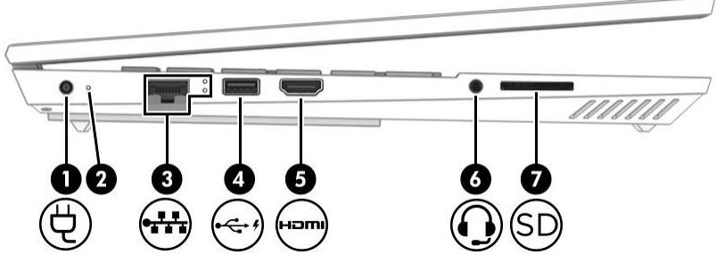
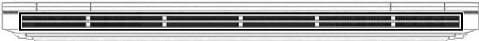

1. BÊN PHẢI

<table><tr><td colspan="2"></td><td>Thanh phan Cóng USB Type-C SuperSpeed</td><td>Mo ta Két noi thiét bi USB, cung cap truyén du lieu</td></tr><tr><td>(1)</td><td>SsG-</td><td>c6 tinh nang HP Sleep and Charge</td><td>tóc do cao, va ngay cä khi may tinh tat có thé sac pin cac thiét bi nho. Két noi mot thiet bi hién thi có dau noi USB Type-C nham cung cáp ngo ra DisplayPortTM. GHI CHU: C6 thé can phai có cap, b@ dói</td></tr><tr><td>(2)</td><td>4</td><td>Cóng USB Type-C ThunderboltTM có tinh nang HP Sleep and Charge</td><td>nguon (mua rieng) hoac ca hai. Két noi thiet bi USB, cung cap truyén du lieu tóc do cao, va ngay cä khi may tinh tat có thé sac pin cac thiét bi nho. Ket noi mot thiet bi hien thi c6 dau noi USB Type-C nham cung cáp ngo ra DisplayPort. GHI CHU: May tinh cua ban cung c6 thé hó tro tram ghép nói Thunderbolt.</td></tr><tr><td>(3)</td><td>D</td><td>Dau noi Dual-Mode DisplayPort</td><td>GHI CHU: C6 thé can phai có cap, b@ di nguon (mua rieng) hoac ca hai. Két noi voi thiét bi hien thi ky thuat so tuy chon, nhu man hinh hoäc may chiéu hiéu suat cao.</td></tr><tr><td colspan="3" rowspan="1">Thanh phan</td><td colspan="1" rowspan="1">Mo ta</td></tr><tr><td colspan="1" rowspan="1">(4)</td><td colspan="1" rowspan="1"></td><td colspan="1" rowspan="1">Khe thong gi6</td><td colspan="1" rowspan="1">Cho phép luong gi6 lam mat cac thanh phanbén trong.GHI CHU: Quat may tinh tu khoi dong dé lammat các thanh phan bén trong va ngan ngfiaqua nhiet. Hien tuong quat bén trong luc batluc tat theo chu trinh vän hanh la binh thuong.</td></tr><tr><td colspan="1" rowspan="1">(5)</td><td colspan="1" rowspan="1">心</td><td colspan="1" rowspan="1">Cong USB (2)</td><td colspan="1" rowspan="1">Két noi thiét bi USB, cung cap truyén dfi lieu,va sac cac thiét bi nho khi may tinh dang bathoac δ ché do Ngu (dói voi mót só san phamnhat dinh).</td></tr></table>

# 2. BÊN TRÁI

<table><tr><td colspan="3" rowspan="1">Thanh phan</td><td colspan="1" rowspan="1">Mo ta</td></tr><tr><td colspan="1" rowspan="1">(1)</td><td colspan="1" rowspan="1">总</td><td colspan="1" rowspan="1">Dau noi nguon</td><td colspan="1" rowspan="1">Ket noi bo doi nguon AC.</td></tr><tr><td colspan="1" rowspan="1">(2)</td><td colspan="1" rowspan="1"></td><td colspan="1" rowspan="1">Den bao bo doi nguonAC va pin</td><td colspan="1" rowspan="1">Mau trang: Bo doi nguon AC dang két noi va pin daduoc sac day.</td></tr><tr><td colspan="1" rowspan="3"></td><td colspan="1" rowspan="3"></td><td colspan="1" rowspan="3"></td><td colspan="1" rowspan="1">Nhap nhay mau trang (chi mot só san pham): Bo doinguon AC bi ngat dau nói va pin da dat dén mirc pinyeu.</td></tr><tr><td colspan="1" rowspan="1">Mau ho phach: Bo doi nguon AC duoc két noi va pindang duoc sac.</td></tr><tr><td colspan="1" rowspan="1">Tat: Dang khong sac pin.</td></tr><tr><td colspan="1" rowspan="2">(3)</td><td colspan="1" rowspan="2">前</td><td colspan="1" rowspan="2">Den trang thai/giaccäm (mang) RJ-45</td><td colspan="1" rowspan="1">Ket noi voi day cap mang.Mau trang: Mang da duoc két noi</td></tr><tr><td colspan="1" rowspan="1">Mau ho phach: Hoat dong dang dien ra tren mang.</td></tr><tr><td colspan="1" rowspan="1">（4)</td><td colspan="1" rowspan="1">不</td><td colspan="1" rowspan="1">Cong USB c6 tinhnäng HP Sleep andCharge</td><td colspan="1" rowspan="1">Két noi mot thiet bi USB, truyén dfi lieu va sac diencac thiét bi nho, ké cä khi may tinh da tat nguon.</td></tr><tr><td colspan="1" rowspan="1">(5)</td><td colspan="1" rowspan="1">HOMI</td><td colspan="1" rowspan="1">Cong HDMI</td><td colspan="1" rowspan="1">Két noi voi thiét bi am thanh hoäc video tuy chon, vidu nhu tivi d@ nét cao, bät ky thanh phan ky thuat sóhoac am thanh tuong thich nao hoäc thiét bi Giao tiépDa phuong tien D@ net Cao (High-DefinitionMultimedia Interface, HDMI) tóc d@ cao.</td></tr><tr><td colspan="1" rowspan="1">6</td><td colspan="1" rowspan="1">0</td><td colspan="1" rowspan="1">Giac ket hop Amthanh ra (tai nghe)/Amthanh vao (micró)</td><td colspan="1" rowspan="1">Két noi loa stereo chay dien, tai nghe, tai nghe cam trong, tai nghe gän micró hoäc cap am thanh TV tuychon. Cung có thé két nói micró kem tai nghe tuychon. Giac cäm nay khong hó trg micro doc lap tuychon.CANH BAO! Dé giam nguy co thuong tich ca nhan,diéu chinh am luong truóc khi deo tai nghe, tai nghenhet tai hoac tai nghe gan micró. Dé biét thém thong tin an toan, xem Thóng bao vé Quy dinh, An toan va</td></tr><tr><td colspan="2">Thanh phan</td><td>Moi truong.</td><td>Mo ta</td></tr><tr><td></td><td></td><td>Dau doc thé nho</td><td>GHI CHU: Khi két noi mot thiét bi voi giac cam nay, loa may tinh sé bi vo hiéu hóa.</td></tr><tr><td>（7）</td><td>SD</td><td></td><td>Doc nhung thé nhó tuy chon cho phép ban luu tru, quan ly, chia sé hoac truy cap thong tin. Dé lap thé: Giu mat thé c6 nhan huóng lén trén, voi dau noi huong vao may tinh. Lap thé vao dau doc thé nhó roi an thé vao trong cho dén khi thé khop. Dé rut thé ra: ▲An thé vao trong,va sau dó rut thé ra khoi dau</td></tr></table>

# 3. MẶT SAU

<table><tr><td>Thanh phan</td><td>Mo ta</td></tr><tr><td rowspan="4">Khe thong gi6</td><td>Cho phep luong gi6 lam mat cac thanh phan ben trong.</td></tr><tr><td>GHI CHU: Quat may tinh tur khoi dong dé lam mat cac thanh phan bén</td></tr><tr><td> trong va ngan ngfia qua nhiet. Thong thuong quat ben trong luc bat luc</td></tr><tr><td>tat theo chu trinh van hanh.</td></tr></table>