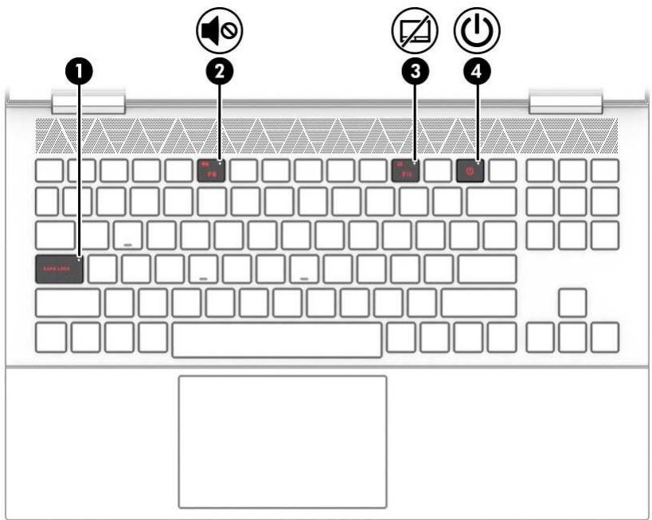
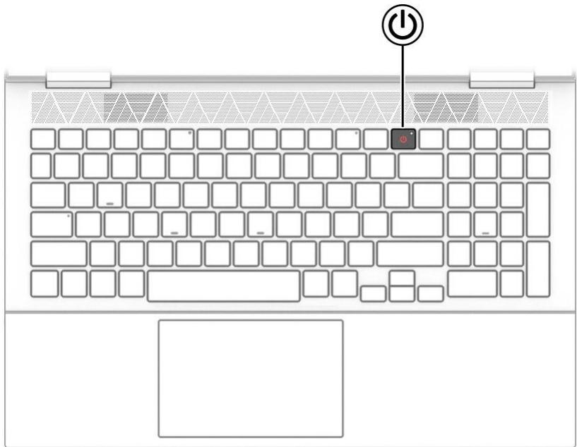

# 1. BÀN DI CHUỘT

# Cài đặt Bàn di chuột

Để điều chỉnh cài đặt và cử chỉ của bàn di chuột, hoặc để tắt bàn di chuột:

- Nhập touchpad settings (cài đặt bàn di chuột) vào ô tìm kiếm trên thanh tác vụ, sau đó nhấn enter.

- Chọn một cài đặt.

# Để bật bàn di chuột

- Nhập touchpad settings (cài đặt bàn di chuột) vào ô tìm kiếm trên thanh tác vụ, sau đó nhấn enter.

- Sử dụng chuột ngoài nhấp vào nút touchpad (bàn di chuột). – hoặc – Nhấn phím Tab nhiều lần đến khi con trỏ nằm trên nút touchpad (bàn di chuột). Sau đó, nhấn phím cách để chọn nút.

<table><tr><td colspan="2" rowspan="1">Thanh phan</td><td colspan="1" rowspan="1">Mo ta</td></tr><tr><td colspan="1" rowspan="1">(1)</td><td colspan="1" rowspan="1"> Vung ban di chuot</td><td colspan="1" rowspan="1">Doc cac cir chi cua ngon tay dé di chuyén con tro hoackich hoat các muc tren man hinh.GHI CHU: Dé biét thém thong tin, xem Sfi dung cfi chi</td></tr><tr><td colspan="1" rowspan="1"></td><td colspan="1" rowspan="1"></td><td colspan="1" rowspan="1">tren touchpad va man hinh cam ing thu@c trang 27.</td></tr><tr><td colspan="1" rowspan="1">(2)</td><td colspan="1" rowspan="1">Nut ban di chuot trai</td><td colspan="1" rowspan="1"> Hoat dong nhu nut trai cua chuot ngoai.</td></tr><tr><td colspan="1" rowspan="1">(3)</td><td colspan="1" rowspan="1">Nut ban di chuot phai</td><td colspan="1" rowspan="1"> Hoat dong nhu nut phai cua chuot ngoai.</td></tr></table>

2. ĐÈN

<table><tr><td colspan="3" rowspan="1">Thanh phan</td><td colspan="1" rowspan="1">Mo ta</td></tr><tr><td colspan="1" rowspan="1">(1)</td><td colspan="1" rowspan="1"></td><td colspan="1" rowspan="1">Den bao phimkhóa viét hoa</td><td colspan="1" rowspan="1">Bat: Phim khoa viet hoa dang bat, moi ky tu nhap vao séchuyén thanh chu viét hoa.</td></tr><tr><td colspan="1" rowspan="2">(2)</td><td colspan="1" rowspan="2"></td><td colspan="1" rowspan="2">Den tat tieng</td><td colspan="1" rowspan="1">Bat: Am thanh may tinh da tat.</td></tr><tr><td colspan="1" rowspan="1">Tat: Am thanh may tinh dang bat.</td></tr><tr><td colspan="1" rowspan="2">(3)</td><td colspan="1" rowspan="2">A</td><td colspan="1" rowspan="2">Den ban dichuot</td><td colspan="1" rowspan="1">Bat: Ban di chuot tat.</td></tr><tr><td colspan="1" rowspan="1">Tat: Ban di chuot bat.</td></tr><tr><td rowspan="3">(4)</td><td rowspan="3">C</td><td rowspan="3">Den nguon</td><td>Bat: May tinh dang bat. Nháp nhay (chi mot só san pham): May tinh dang ó trang thai Ngu, trang thai tiét kiem dien. May tinh ngät dién dén man hinh va cac thanh phan khong can thiét khac.</td></tr><tr><td colspan="1">Tat: Tuy theo model may tinh, may tinh cua ban sé ó trang thai tat, Ngu dong hoac Ngu. Ngu dong la trang</td></tr><tr><td colspan="1">thai tiét kiem dien sur dung it dien nang nhat.</td></tr></table>

3. NÚT

<table><tr><td colspan="2">Thanh phan</td><td>Mo ta</td></tr><tr><td>C</td><td>Nut nguon</td><td>Khi may tinh tat, nhan nut nay dé bat may tinh. Khi may tinh bät, nhän nhanh nut nay dé vao ché d@ Ngu. Khi may tinh dang ó trang thai Ngu, nhan nhanh nut nay dé thoat ché</td></tr></table>

<table><tr><td></td><td>do Ngu (chi mót só san pham). Khi may tinh dang o trang thai Ngu dong, nhan nhanh nut nay dé thoat ché d@ Ngu dong. QUAN TRQNG: Nhan va giur nut nguon sé lam mat nhfing thong tin chua luru. Néu may tinh ngung phan hoi va quy trinh tat may vo hiéu, nhan va nhan gifi nut nguon trong it nhat 10 giay dé tat may tinh. Dé tim hiéu thém vé cac cai dat nguon dién, hay xem cac tuy chon</td></tr></table>

# 4. PHÍM ĐẶC BIỆT

<table><tr><td colspan="3">Thanh phan</td><td>Mo ta</td></tr><tr><td>(1)</td><td></td><td>Phim thao tac</td><td>Thuc hien cac churc nang hé thong duoc sfi dung thuong xuyén khi duoc bäm két hop voi phim fn. Cac phim thao tac duoc dinh nghia boi cac ky hieu biéu tuong trén cac</td></tr><tr><td colspan="1" rowspan="1">(2)</td><td colspan="1" rowspan="1">圃</td><td colspan="1" rowspan="1">Phim may tinhtay</td><td colspan="1" rowspan="1"> Mo chuong trinh may tinh tay.GHI CHU: Nhan phim mot lan nfia dé dóng may tinhtay.</td></tr><tr><td colspan="1" rowspan="1">(3)</td><td colspan="1" rowspan="1"></td><td colspan="1" rowspan="1">Phim esc</td><td colspan="1" rowspan="1">Hién thi thong tin heé thong khi nhan két hop voi phim fn.</td></tr><tr><td colspan="1" rowspan="1">(4</td><td colspan="1" rowspan="1"></td><td colspan="1" rowspan="1">Phim fn</td><td colspan="1" rowspan="1">Thuc hien cac churc nang cu thé khi duoc bam két hopvoi phim khac.</td></tr><tr><td colspan="1" rowspan="1">(5)</td><td colspan="1" rowspan="1">出</td><td colspan="1" rowspan="1">Phim Windows</td><td colspan="1" rowspan="1">Mo menu Start (Bat dau). GHI CHU: Nhan phim Windows mot lan nfia sé dóngmenu Start (Bät dau).</td></tr><tr><td colspan="1" rowspan="1">（6</td><td colspan="1" rowspan="1">目</td><td colspan="1" rowspan="1">Phim ung dungWindows</td><td colspan="1" rowspan="1"> Hien thi cac tuy chon cho mot doi tuong duoc chon.</td></tr><tr><td colspan="1" rowspan="1">（7)</td><td colspan="1" rowspan="1">C</td><td colspan="1" rowspan="1">Nut nguon</td><td colspan="1" rowspan="1">Khi may tinh tat, nhan nut nay dé bät may tinhKhi may tinh bat, nhan nhanh nut nay dé vao ché d@ Ngu.Khi may tinh dang ó trang thai Ngu, nhan nhanh nut naydé thoat ché do Ngu (chi mot só san pham).Khi may tinh dang ó trang thai Ngu dong, nhan nhanhnut nay dé thoat ché do Ngu dong.QUAN TRONG: Nhan va git nut nguon sé lam matnhfing thong tin chua luu.Néu may tinh ngung phan hoi va quy trinh tat may vo hieu, nhan va nhan gifi nut nguon trong it nhat 1O giay détat may tinh.Dé tim hiéu them vé cac cai dat nguon dien, hay xem cactuy chon nguon dien cua ban:</td></tr><tr><td colspan="1" rowspan="1">（8</td><td colspan="1" rowspan="1">■</td><td colspan="1" rowspan="1">Phim OMEN</td><td colspan="1" rowspan="1">Nhap chuot phai vao bieu turong Power (Nguon), roi saud6 chon Power Options (Tuy chon Nguon dien).</td></tr><tr><td>（9)</td><td></td><td>Phim num lock</td><td>Chuyén doi gifia cac chirc nang diéu huong va só trén ban phim só tich hop.</td></tr><tr><td>(10)</td><td></td><td>Ban phim só tich hop</td><td>Ban phim só riéng biet nam bén phai ban phim chfi cai. Khi nhän phim num lock, có thé sur dung ban phim nay nhu ban phim só gän ngoai.</td></tr></table>

# 5. PHÍM THAO TÁC

Các phím thao tác sẽ thực thi các chức năng hệ thống sfi dụng thường xuyên như được định nghĩa bởi các ký hiệu biểu tượng trên các phím chức năng từ f1 đến f12.

Các phím thao tác này sẽ khác nhau tùy theo máy tính.

Để sử dụng một phím thao tác, nhấn fn, rồi nhấn một trong các phím được liệt kê trong bảng sau.

<table><tr><td colspan="1" rowspan="1">Bieu turong</td><td colspan="1" rowspan="1">Mo ta</td></tr><tr><td colspan="1" rowspan="1"></td><td colspan="1" rowspan="1">Chuyén doi hinh anh man hinh giua cac thiét bi hién thi két noi voi hé thóng. Vidu: néu may tinh duoc két noi voi mot man hinh, nhan lien tiép phim nay sé thaydi hinh anh man hinh tu man hinh may tinh sang man hinh duoc két nói va sanghién thi dong thoi tren ca may tinh va man hinh.</td></tr><tr><td colspan="1" rowspan="1">米</td><td colspan="1" rowspan="1">Giam dan do sang man hinh bang cach nhan giu phim</td></tr><tr><td colspan="1" rowspan="1">米</td><td colspan="1" rowspan="1">Tang dan do sang man hinh bang cach nhan giur phim.</td></tr><tr><td colspan="1" rowspan="1">画</td><td colspan="1" rowspan="1">Bat hoac tat den nén ban phim. Tren mot so san pham nhat dinh, ban c6 thé dieuchinh d@ sáng cua den nén ban phim. Nhan phim nay lien tuc dé diéu chinh dó sang tur cao (khi ban lan dau tien khoi dong may tinh) xuóng thap hoac tat. Saukhi ban diéu chinh cai dat den nén ban phim, den nén sé tro vé cai dät truoc dómöi lan ban bat nguon may tinh. Den nén ban phim sé tat sau 30 giay khong hoatdong. Dé bat lai den nén ban phim, nhan phim bat ky hoäc nhan vao ban di chut</td></tr><tr><td colspan="1" rowspan="1"></td><td colspan="1" rowspan="1">(chi c6 o mot s san pham nhat dinh). Dé tiet kiem nguon pin, hay tat tinh nangnay.</td></tr><tr><td colspan="1" rowspan="1"></td><td colspan="1" rowspan="1">Tat tieng hoac khoi phuc am thanh loa.</td></tr><tr><td colspan="1" rowspan="1">1</td><td colspan="1" rowspan="1">Giam dan am lrong loa trong khi ban nhan gitr phim.</td></tr><tr><td colspan="1" rowspan="1">+</td><td colspan="1" rowspan="1">Tang dan am luong loa trong khi ban nhan git phim.</td></tr><tr><td colspan="1" rowspan="1">Λ</td><td colspan="1" rowspan="1">Phat bai truoc trong dia CD am thanh hoac phan truoc trong dia DVD hay diaBlu-ray (BD).</td></tr><tr><td colspan="1" rowspan="1">=</td><td colspan="1" rowspan="1">Bät dau, tam dfing hoäc tiép tuc phat lai dia CD am thanh, DVD hoac dia BD.</td></tr><tr><td colspan="1" rowspan="1">V</td><td colspan="1" rowspan="1">Phat bai tiep theo trong dia CD am thanh hoac phan tiep theo trong dia DVD haydia Blu-ray (BD).</td></tr><tr><td colspan="1" rowspan="1">日</td><td colspan="1" rowspan="1">Bat hoac tat ban di chuot.</td></tr><tr><td colspan="1" rowspan="1">1</td><td colspan="1" rowspan="1">日Tat va bat phim Windows </td></tr></table>