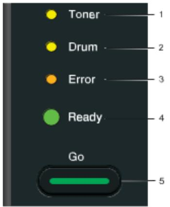

1. LED

Phần này có 4 nút LED và nút Go trên bảng điều khiển

1) Toner LED: nút này biểu thị lượng mực còn lại thấp   
2) Drum LED: biểu thị Drum cần được thay thế sớm   
3) Error LED: biểu thị khi máy đang ở 1 trong các tình trạng sau: Không có giấy/   
Kẹt giấy / Nắp vẫn mở   
4) Ready LED: nút này sẽ nhấp nháy phụ thuộc vào tình trạng của máy   
5) Nút Go: Sẵn sàng/ khôi phục lỗi/ nhập định dạng/ hủy bỏ lệnh/ in lại/ mở hoặc   
tắt đường truyền mạng (chỉ có ở HL-2270DW)

<table><tr><td colspan="1" rowspan="1">Dén LED</td><td colspan="1" rowspan="1">Tinh trang cüa may</td></tr><tr><td colspan="1" rowspan="2">OTonerODrumOErrar·Ready</td><td colspan="1" rowspan="1">SLEEPMay dang trong Sleep Mode: giong nhu trang thai may datat. Nhung khi nhan nut Go hay nhan duoc tin hieu thi maysé tur dong chuyén sang ché do Ready.</td></tr><tr><td colspan="1" rowspan="1">DEEPSLEEPNéu may khong nhan duoc bat cur tin hiéu nao khi dang óché d@ Sleep thi sau mot khoang thoi gian nó sé tur dongchuyén sang ché d@ Deep sleep. Nhán nut Go hay truyén</td></tr><tr><td colspan="1" rowspan="1"></td><td colspan="1" rowspan="1">Tenhin demaytrolaichedqReadyRieng may HL-2270DW néu mang wireless duoc kichhoat thi may sé khong di vao trang thai Deep Sleep.</td></tr><tr><td colspan="1" rowspan="2">OTonerODrumOErrar Ready</td><td colspan="1" rowspan="1">READYMay san sang dé in</td></tr><tr><td colspan="1" rowspan="1">PRINTINGMay dang in</td></tr><tr><td colspan="1" rowspan="4">OTonerODrumOErroready</td><td colspan="1" rowspan="1">WARMING UPMay dang duoc khoi dong</td></tr><tr><td colspan="1" rowspan="1">COOLING DOWNMay dang duoc lam mat, doi 1 lat cho cac phan ben trongmay duoc lam mat lai</td></tr><tr><td colspan="1" rowspan="1">RECEIVING DATAMay hoäc la dang nhan du lieu tur may tinh hoac la dang xir ly dur lieu</td></tr><tr><td colspan="1" rowspan="1">DATA REMAININGC6 du liéu in con trong b@ nho. Néu thay den nhay lau machua tháy may in thi nhán nut Go dé in dur lieu trong bónho.</td></tr><tr><td colspan="1" rowspan="1"> TonerODrumOErrar Ready</td><td colspan="1" rowspan="1">TONER LOWHop muc can duoc thay sóm. Mua muc moi dé san sangthay khi bao hiéu REPLACE TONER.Den sé sang trong 2 giay va tat trong 3 giay</td></tr><tr><td colspan="1" rowspan="1">·TonerO DrumOErrarO Ready</td><td colspan="1" rowspan="1">REPLACE TONERThay muc moiCARTRIDGE ERRORTruc tróng tur có thé chua duoc lap chinh xac, thao ra va</td></tr><tr><td colspan="1" rowspan="1"></td><td colspan="1" rowspan="1"> gan lai vao may mot lan nuaNO TONER Mo mat truoc cua may ra va cho hop murc vao</td></tr><tr><td colspan="1" rowspan="1">OTonerODrumOErrarO Ready</td><td colspan="1" rowspan="1">REPLACETONERMay sé tiép tuc in cho dén khi xuat hien den bao TONERENDED</td></tr><tr><td colspan="1" rowspan="1">TonerODrumErrarO Ready</td><td colspan="1" rowspan="1">TONER ENDEDThay thé hóp muc moi</td></tr><tr><td colspan="1" rowspan="1">OToner DrumOErrar Ready</td><td colspan="1" rowspan="1">DRUM END SOONTruc tróng tr can duoc thay som.Den sé sang trong 2 giay va tat trong 3 giay</td></tr><tr><td colspan="1" rowspan="1">OTonerDrumOError Ready</td><td colspan="1" rowspan="1">REPLACE DRUMThay trong moi</td></tr><tr><td colspan="1" rowspan="2">OTonerODrumErrarO Ready</td><td colspan="1" rowspan="1">NO PAPER T1Dät giay vao khay roi nhan nut Go</td></tr><tr><td colspan="1" rowspan="1">MANUAL FEEDDät giay vao khe cap giay thu cong</td></tr><tr><td colspan="1" rowspan="1">OToner OrumEnerO Ready</td><td colspan="1" rowspan="1">DRUM ERRORDay Cao áp can dugc lam vé sinh</td></tr><tr><td colspan="1" rowspan="1">OToner●DrumErrarO Ready</td><td colspan="1" rowspan="1">DRUM STOPThay truc tróng moi</td></tr><tr><td>OToner ODrum OErr O Ready</td><td>FRONT COVER OPEN Nap day mat truoc may van mo FUSER COVER OPEN D6ng nap khoi say o phia sau lung may</td></tr><tr><td colspan="1">JAM TRAY 1/ JAM INSIDE/ JAM REAR/ JAM DUPLEX Lay giay bi ket ra va néu nhan nut Go néu may chua tién</td></tr><tr><td colspan="1">hanh in MEMORYFULL B@ nhó may bi day va may khong thé in toan b@ trang tai</td></tr><tr><td colspan="1">lieu PRINT OVER RUN Hien tuong nay dien ra va may khong thé in hét cac trang</td></tr><tr><td colspan="1">tai lieu SIZE ERROR DX (HL-2240D/ HL-2250DN/ HL-</td></tr><tr><td colspan="1">2270DW) Dé giay dung kich thuoc ma ban muón in hoac cai lai khó giay trén may. Kh giay ma ban có thé in hai mat tr dong la A4, Letter, Legal va Folio.</td></tr></table>

2. CÁC DẤU HIỆU CẦN GỌI GIÚP ĐỠ

Nếu bạn thấy hiện đèn như trên thì tắt máy và mở máy lên lại và thử in lại. Nếu lỗi vẫn chưa được xóa bỏ thì nhấn nút Go để đèn hiện lên như bảng dưới đây và tương ứng với các lỗi máy đang bị.

<table><tr><td rowspan=1 colspan=1>DenLED</td><td rowspan=1 colspan=1>Hur bochinh</td><td rowspan=1 colspan=1>Hukh6isay</td><td rowspan=1 colspan=1>HuLaser</td><td rowspan=1 colspan=1>Hur Motochinh</td><td rowspan=1 colspan=1>Hur bocao ap</td><td rowspan=1 colspan=1>Quat bihu</td><td rowspan=1 colspan=1>Bo nguonbiloi</td></tr><tr><td rowspan=1 colspan=1>Tone</td><td rowspan=1 colspan=1>tat</td><td rowspan=1 colspan=1>vang</td><td rowspan=1 colspan=1>tt</td><td rowspan=1 colspan=1>vang</td><td rowspan=1 colspan=1>vang</td><td rowspan=1 colspan=1>tat</td><td rowspan=1 colspan=1>vang</td></tr><tr><td rowspan=1 colspan=1>Drum</td><td rowspan=1 colspan=1>tat</td><td rowspan=1 colspan=1>tat</td><td rowspan=1 colspan=1>vang</td><td rowspan=1 colspan=1>tat</td><td rowspan=1 colspan=1>vang</td><td rowspan=1 colspan=1>vang</td><td rowspan=1 colspan=1>vang</td></tr><tr><td rowspan=1 colspan=1>Error</td><td rowspan=1 colspan=1>cam</td><td rowspan=1 colspan=1>tat</td><td rowspan=1 colspan=1>tat</td><td rowspan=1 colspan=1>cam</td><td rowspan=1 colspan=1>tat</td><td rowspan=1 colspan=1>cam</td><td rowspan=1 colspan=1>cam</td></tr><tr><td rowspan=1 colspan=1>Ready</td><td rowspan=1 colspan=1>tat</td><td rowspan=1 colspan=1>tat</td><td rowspan=1 colspan=1>tt</td><td rowspan=1 colspan=1>tt</td><td rowspan=1 colspan=1>tat</td><td rowspan=1 colspan=1>tat</td><td rowspan=1 colspan=1>tat</td></tr></table>