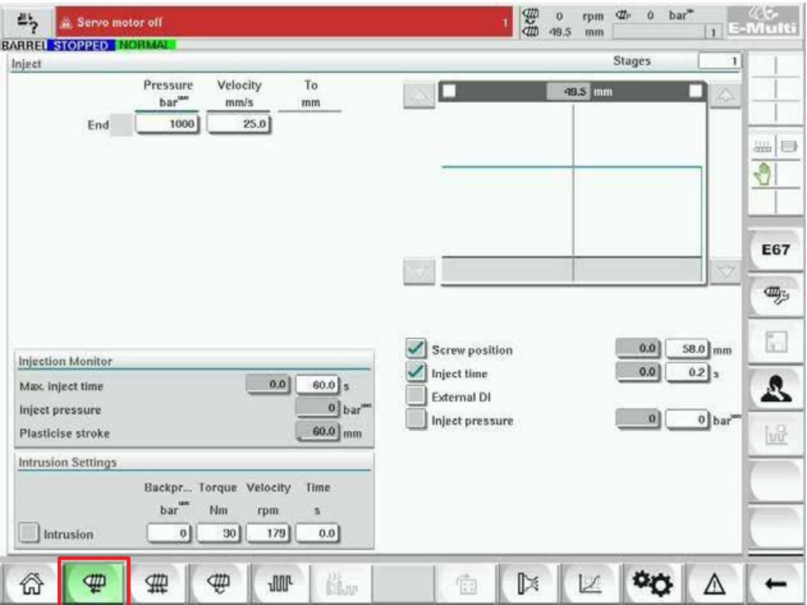

Màn hình này dùng để điều chỉnh cài đặt chuyển động của trục vít trong khi phun. Màn hình này cũng dùng để điều chỉnh điểm chuyển tiếp mà tại đó hệ thống thay đổi từ áp suất phun sang áp suất giữ.

Các thành phần trên màn hình cài đặt phun

<table><tr><td>Cac thanh phan trén man hinh</td><td>Mo ta</td></tr><tr><td>BARREL RUNNING NORMAL Injeet Stages</td><td>Inject (Phun) Phan nay hién thi cáu hinh phun hién tai. Cáu hinh nay hién thi theo só trong cac truong ó bén trai va theo biéu dó trong cac truong ó bén phai.Só buoc phun c6 thé diéu chinh duoc bang truong giai</td></tr><tr><td colspan="1" rowspan="1"></td><td colspan="1" rowspan="1">doan o trén cung ben trai. Ban c6 thé chon toi dala 10 buoc.</td></tr><tr><td colspan="1" rowspan="1">InjectPressure Velocity    Tobas   mmis     mmEnd   1000    20.0</td><td colspan="1" rowspan="1">Trrong nhap ap suat va van tocBan c6 thé diéu chinh cac muc cai dat nay bangcach nhap gia tri truc tiép vao nhung truong nay.Nhung truong nay dung dé dat Pressure (Ap suat)va Velocity (Van tóc) giua vi tri cuoi cua giaidoan truoc (trong trrong hop giai doan 1, vi tricuói chuyén dong cua b@ phan truoc) va vi tridugc chi dinh trong c@t 'To' (Dén). Buoc cuóicung sé hoan tat khi dap ung mot trong cac diéukién chuyén tiép nay.</td></tr><tr><td colspan="2" rowspan="2">Bieu do nhap ap suat va van tocNgoai ra, cac gia tri Pressure (Ap suat) (mau mongkét) va Velocity (Van tóc) (mau xam) hién thi ódang biéu do cau hinh. Nhung gia tri nay c6 théInjeetVelocity                diéu chinh duoc bang cac phim mui ten bén canhPressureTobar   mm/s    mmEnd   1000   20.0               biéu dó cäu hinh. Möi lan nhan vao mui tén, biéudó cáu hinh dugc diéu chinh +/-5 bar va/hoac +/-] Serew position                 0.0  .0mm   5%.√Inect time                    0.0  0.5sDieu kien chuyen tiep] Inject pressure00baraExternal DI                                        Dung dé dat diéu kien khi hé thóng thay doi tur giaiCut off activation position                 0.0mmdoan phun sang giu.Néu chon nhiéu diéu kien, thay doi se xay ra khidiéu kien dau tien dugc dap ung.</td></tr><tr></tr></table>

<table><tr><td rowspan=1 colspan=1>Cac thanh phan trén man hinh</td><td rowspan=1 colspan=2>Mo ta</td></tr><tr><td rowspan=6 colspan=1></td><td rowspan=1 colspan=2>Kich hoat cac dieu kien bang cach chon hop bentrai cua nhan truong.</td></tr><tr><td rowspan=1 colspan=1> Screw position(Vi tri truc vit)</td><td rowspan=1 colspan=1>Chi dinh vi tri truc vit ma taid6 hé thong thay doi thanh apsuat gir.</td></tr><tr><td rowspan=1 colspan=1>Inject time (Thoigian phun)</td><td rowspan=1 colspan=1>Chi dinh só giay dé he thongthay doi thanh áp suat gitr (dotir luc bat dau qua trinh phun).</td></tr><tr><td rowspan=1 colspan=1>Inject pressure(Ap suat phun)</td><td rowspan=1 colspan=1>Chi dinh ap suat phun ma taid6 hé thong thay doi thanh apsuat git.</td></tr><tr><td rowspan=2 colspan=1>External DI(Dau vao kythuat so benngoai)</td><td rowspan=1 colspan=1>Vi tri ngat duoc bao hieu bangdau vao ky thuat só ben ngoai.Dau vao ky thuat só duoc hiénthi trén so do dien va dan nhan:</td></tr><tr><td rowspan=1 colspan=1>HoldTransition(External)(Chuyén tiép sang gitr (Bénngoai)).</td></tr><tr><td rowspan=1 colspan=1></td><td rowspan=1 colspan=1>Cut OffActivationPosition (Vi tri kich hoat ngat)</td><td rowspan=1 colspan=1>Ap suat phun dé chuyén tiépsé khong duoc theo doi chodén khi vi tri truc vit nhö honvi tri nay. Vi tri nay duocdung dé tranh chuyén tiép khiäp suat phun dat dinh vao luc</td></tr></table>

<table><tr><td rowspan=1 colspan=2>0</td><td rowspan=1 colspan=1>Man hinh thong tin dong co hoac dan dong</td></tr><tr><td rowspan=1 colspan=2></td><td rowspan=1 colspan=1>Biéu do san xuat - Ché d xem có thé dat cäu hinh</td></tr><tr><td rowspan=1 colspan=1></td><td rowspan=1 colspan=1></td><td rowspan=1 colspan=1>Cai dat san xuat</td></tr><tr><td rowspan=1 colspan=1></td><td rowspan=1 colspan=1>tys</td><td rowspan=1 colspan=1>Cai dat tham chiéu</td></tr></table>