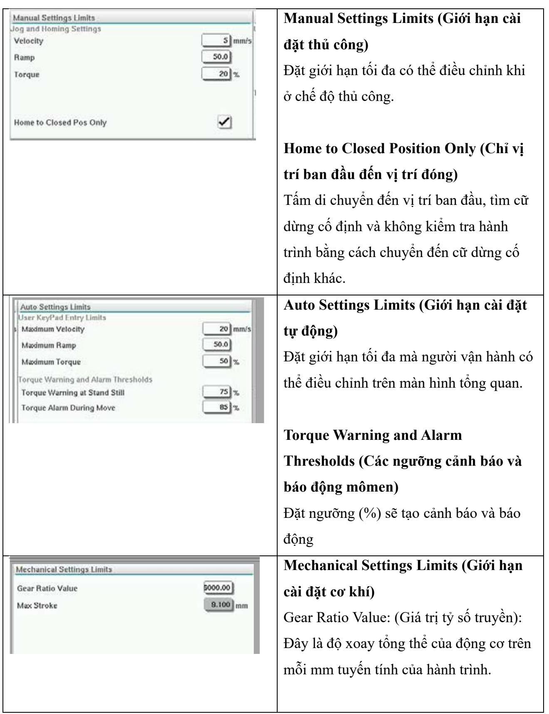
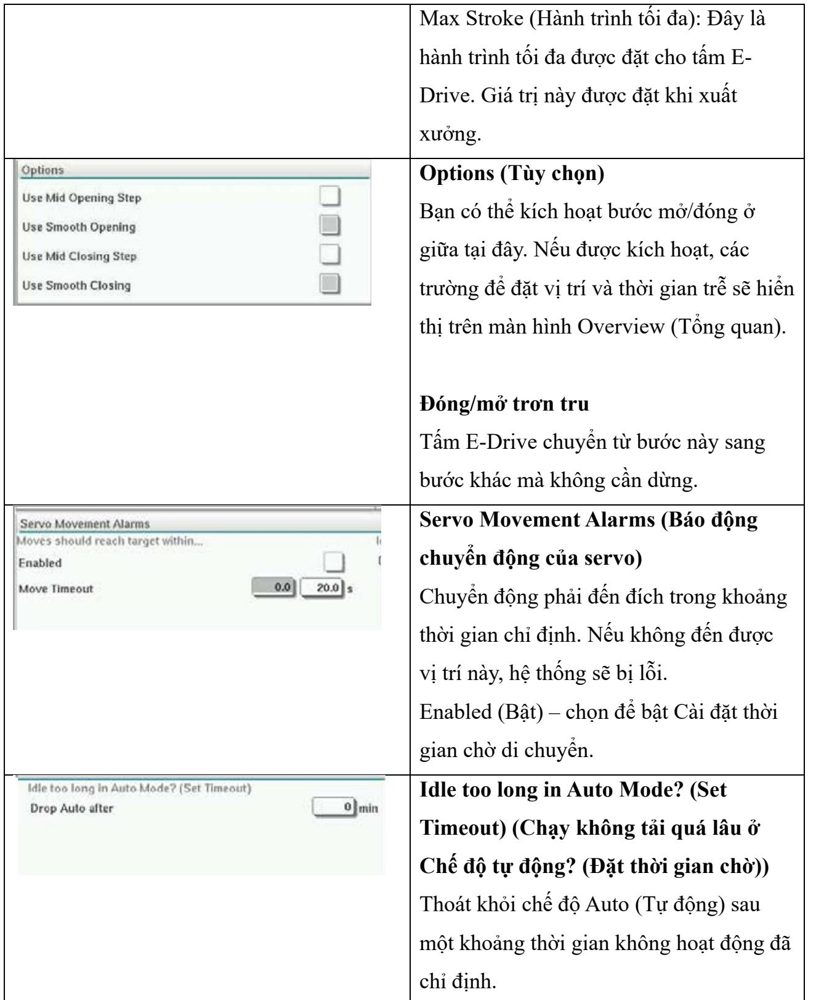

# 1. Màn hình cài đặt (Cấp độ giám sát)

Màn hình này cung cấp thông tin tổng quan về việc vận hành E-Drive tích hợp. Nếu có nhiều tấm E-Drive đang được sử dụng, các nút menu ngữ cảnh bổ sung sẽ truy cập được ở bên phải. Tuy nhiên, nếu sử dụng chế độ Master (Chính) thì sẽ không tiếp cập được bất kỳ tấm phụ thuộc nào ở bên phải, chỉ tiếp cận được các tấm chính.

# Các thành phần trên màn hình cài đặt E-Drive

<table><tr><td>Cac thanh phan trén man hinh</td><td>Mo ta</td></tr></table>

# 2. Màn hình cài đặt cửa van

Màn hình này dùng để điều khiển từng cửa van, thường cho các van điện từ hoạt động đơn lẻ trong hệ thống khí nén hoặc thủy lực.

# Các thành phần trên màn hình cài đặt cửa van

<table><tr><td></td><td rowspan=1 colspan=1>Cac thanh phan trén man hinh</td><td rowspan=1 colspan=1>Mo ta</td></tr><tr><td></td><td rowspan=1 colspan=1>Valves1and2Vave3and4</td><td rowspan=1 colspan=1>Cac tab  dau man hinhCac tab ó dau man hinh sé dua nguoidung dén phan cai dat cho hai cira vancung mot luc (vi du: Van 1 va 2; Van 3 va4).Nguoi dung c6 thé dat thoi gian va bokich hoat Mo va D6ng</td></tr><tr><td rowspan=2 colspan=2>Valve1Open TriggerofDelay time open           0000</td><td rowspan=1 colspan=1>Open Trigger (B@ kich hoat mó)Cac tuy chon tha xuong:Off(Tat)MoldClosing (Dóng khuon)Khuon ZA6 da dóng - tin hiéuZB3 Phun lui 1 - tin hiéu (phun)ZB4 Phun tién 1 - tin hiéu (phun)ZB5 Loi 1 Vi tri 1 - tin hieu (ro-bót) ZB5Loi 1 Vi tri 2 - tin hiéu (ro-bót) ZB5Loi 2 Vi tri 1 - tin hiéu (ro-bót) ZB5Loi 2 Vi tri 2 - tin hiéu (ro-bót)</td></tr><tr><td rowspan=1 colspan=1>Delay time open (Thoi gian tré mó)Ngoai bó kich hoat mó, ban có thé thémthoi gian tré tinh theo giay dé tinh chinh</td></tr></table>

<table><tr><td rowspan=1 colspan=1></td><td rowspan=1 colspan=1>chuyén dong cua van tuong ung voi tinhieu cua b@ kich hoat.</td></tr><tr><td rowspan=2 colspan=1>Close TriggerAfter Emulti HoldDelay time close             0.00.0]s</td><td rowspan=1 colspan=1>Close Trigger (B@ kich hoat dong)Cac tuy chon tha xuong: Sau khi giu E-MultiSau khi giam áp E-Multi Sau khi déo hóaE-Multi</td></tr><tr><td rowspan=1 colspan=1>Delay time close (Thoi gian tré dong)Ngoai b@ kich hoat dóng,ban có thé thémthoi gian tré tinh theo giay dé tinh chinhchuyén dong cua van tuong ung voi tinhiéu cua b@ kich hoat.</td></tr><tr><td rowspan=1 colspan=1>StatusOpenedClosed</td><td rowspan=1 colspan=1>Trang thai hien taiM@t hop chi bao mau luc cho biét liéucura van hien dang mo hay da dong.</td></tr></table>