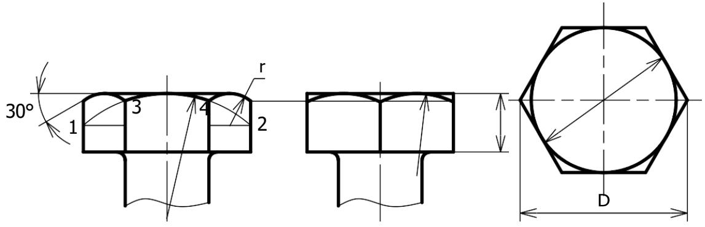
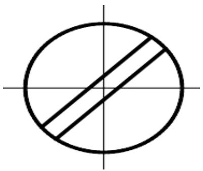

# 1. CÁC CHI TIẾT GHÉP CÓ REN

Các chi tiết lắp xiết gồm có: bulông, đai ốc, vít cấy, vít, vòng đệm, chúng thường tạo thành một bộ để lắp ghép các chi tiết với nhau. Các chi tiết lắp xiết là những chi tiết tiêu chuẩn hoá.

Bảng dưới đây là các hình chiếu và cách ghi ký hiệu các chi tiết lắp xiết cách ghi ký hiệu các chi tiết lắp xiết

<table><tr><td colspan="1" rowspan="1">Phanloai</td><td colspan="1" rowspan="1">Ten goi</td><td colspan="1" rowspan="1">Hinh dang</td><td colspan="1" rowspan="1">Hinh chiéu</td><td colspan="1" rowspan="1">Ky hieu</td></tr><tr><td colspan="1" rowspan="1">Bulong</td><td colspan="1" rowspan="1">Bulongtinh dauSau canh</td><td colspan="1" rowspan="1"></td><td colspan="1" rowspan="1">50</td><td colspan="1" rowspan="1">BulongM12 x 50TCVN1892-76</td></tr><tr><td colspan="1" rowspan="1">Vit</td><td colspan="1" rowspan="1">Vit cay</td><td colspan="1" rowspan="1">（）））</td><td colspan="1" rowspan="1">=45</td><td colspan="1" rowspan="1">Vit cay A1-M12 x45TCVN3608-81</td></tr><tr><td colspan="1" rowspan="3"></td><td colspan="1" rowspan="1">Vit dautru</td><td colspan="1" rowspan="1">2</td><td colspan="2" rowspan="1">Vit dau truM10 x 4545TCVN52-86</td></tr><tr><td colspan="1" rowspan="1">Vit dauchim</td><td colspan="1" rowspan="1">Q</td><td colspan="2" rowspan="1">Vit dau chimM10 x4545                  TCVN58-86</td></tr><tr><td colspan="1" rowspan="1">Vit dinh vi</td><td colspan="3" rowspan="1">Vit duoi thänghinhnonM5x205TCVN 1905-2076</td></tr><tr><td colspan="1" rowspan="1">Dai</td><td colspan="1" rowspan="1">Dai oc</td><td colspan="1" rowspan="1"></td><td colspan="1" rowspan="1"></td><td colspan="1" rowspan="1">Dai óc 1-M16TCVN 1905-76</td></tr><tr><td colspan="1" rowspan="2"></td><td colspan="1" rowspan="1">Dai oc xéranh</td><td colspan="1" rowspan="1"></td><td colspan="1" rowspan="1">00</td><td colspan="1" rowspan="1">Dai óc xéranh 1-M16TCVN1911-76</td></tr><tr><td colspan="1" rowspan="1">Vong dem</td><td colspan="1" rowspan="1"></td><td colspan="1" rowspan="1">③</td><td colspan="1" rowspan="1">Vong dem 16TCVN 2061-77</td></tr></table>

# 2. MỐI GHÉP REN • Mối ghép bulông

Trong mối ghép bulông, các chi tiết bị ghép có lỗ trơn. Các chi tiết lắp xiết gồm có bulông, đai ốc và vòng đệm. Kích thước đường kính danh nghĩa của bulông là kích thước cơ bản để xác định các kích thước khác của mối ghép, d:là đường kính danh nghĩa của ren.

Cách vẽ đầu bulông như hình 7.10:

  
Hình 7.10 Cách vẽ đầu bulông

# 3. MỐI GHÉP VÍT CẤY

Trong mối ghép vít cấy, một chi tiết bị lắp có lỗ ren và chi tiết bị lắp khác có lỗ trơn. Bộ chi tiết lắp xiết gồm có vít cấy, đai ốc và vòng đệm. Các kích thước của mối ghép được lấy theo đường kính danh nghĩa d của vít cấy.Trên bản vẽ, mối ghép vít cấy được vẽ theo quy ước.

Căn cứ theo vật liệu của chi tiết có lỗ ren để xác định chiều dài l của vít cấy:

- Nếu chi tiết có lõ ren bằng thép thì lấy $1 _ { 1 } = \mathrm { d }$ .   
- Nếu chi tiết có lỗ ren bằng gang thì lấy $_ { 1 1 } = 1 \small { , } 2 5 \mathrm { d }$ .   
- Nếu chi tiết có lỗ ren bằng hợp kim nhẹ thì lấy $1 _ { 1 } = 2 \mathrm { d }$ .

# 4. MỐI GHÉP VÍT

Trong mối ghép vít, phần ren vít được vặn vào lỗ ren của chi tiết bị ghép. Còn đầu vít ép chặt vào chi tiết bị ghép kia (hình 7.12).

Tiêu chuẩn qui định rãnh vít trên mặt phẳng hình chiếu đặt song song với trục của vít, chiếu dài rãnh vít đặt song song với phương chiếu. Trên hình chiếu vuông góc với trục, rãnh vít được vẽ ớ vị trí đã xoay đi góc $4 5 ^ { \circ }$ .

Trong trường hợp không cần thể hiện rõ mối ghép, cho phép vẽ đơn giản

