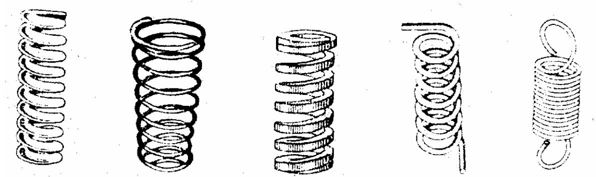

# 1. KHÁI NIỆM CHUNG

- Lò xo làm việc dựa vào tính đàn hồi của nó. Lò xo là chi tiết dự trữ năng lượng dùng để giảm xóc, ép chặt, đo lực ...

- Căn cứ theo kết cấu và công dụng, lò xo được chia làm bốn loại sau đây:

# • Lò xo xoắn ốc

Lò xo xoắn ốc được hình thành theo đường xoắc ốc trụ hoặc đường xoắn ốc nón. Căn cứ theo tác dụng, lò xo xoắn ốc được chia thành các loại: lò xo nén, lò xo xoắn và lò xo kéo.

# • Lò xo xoắn phẳng

Lò xo xoắn phẳng được hình thành theo đường xoắn ốc phẳng, mặt cắt của dây lò xo thường là hình chữ nhật. Lò xo xoắn phẳng thường được dùng làm dây cót.

• Lò xo nhíp

Gồm nhiều tấm kim loại ghép với nhau được dùng nhiều trong các cơ cấu giảm sóc, nhất là trong ô tô.

# • Lò xo đĩa

Lò xo đĩa (H. 7-13) gồm nhiều đĩa làm bằng kim loại ghép chồng lên nhau, dùng trong các cơ cấu có tải trọng lớn.

# 2. VẼ QUY ƯỚC LÒ XO

- Lò xo có kết cấu, hình dạng phức tạp nên được TCVN 14-78 quy định vẽ theo quy ước. Một số thí dụ vẽ quy ước lò xo trình bày trong bảng.

- Trên hình chiếu và hình cắt của lò xo xoắn trụ (hoặc nón), vòng xoắn được vẽ bằng đường thẳng thay cho đường cong

- Đối với lò xo xoắn trụ (hoặc nón) có số vòng xoắn lớn hơn bốn thì quy định chỉ vẽ ở mỗi đầu một hoặc hai vòng xoắn (trừ vòng tì), những vòng còn lại không vẽ và được thay thế bằng nét chấm gạch mảnh vẽ qua tâm mặt cắt của dây lò xo. Cũng cho phép vẽ rút ngắn chiều cao của lò xo (mục 1-2).

- Những lò xo có đường kính hay chiều dày dây lò xo nhỏ hơn hoặc bằng 2 mm thì vòng xoắn được vẽ bằng nét liền đậm, mặt cắt của dây lò xo được tô đen.

- Đối với lò xo xoắn phẳng có số vòng xoắn lớn hơn hai thì quy định chỉ vẽ vòng đầu và vòng cuối, phần còn lại được vẽ bằng một đoạn nét chấm gạch đậm.

- Đối với lò xo đĩa có số đĩa lớn hơn bốn, thì mỗi đầu được vẽ một hoặc hai đĩa, đường bao của các đĩa còn lại vẽ bằng nét liền mảnh (mục 7).

- Đối với lò xo nhíp hay lò xo lá có nhiều lớp thì quy định chỉ vẽ đường bao của chồng lá (mục 8-9).

- Đối với lò xo có hướng xoắn cho trước thì phải vẽ đúng hướng xoắn của nó và phải ghi "hướng xoắn phải" hoặc "hướng xoắn trái" trong yêu cầu kĩ thuật.

<table><tr><td rowspan=2 colspan=2>Ten goi lo xo</td><td rowspan=1 colspan=3>Hinh ve quy uoc</td></tr><tr><td rowspan=1 colspan=1>Hinh chieu</td><td rowspan=1 colspan=1>Hinh cat</td><td rowspan=1 colspan=1>Khi chieu day matcat cua day ≤ 2mm</td></tr><tr><td rowspan=3 colspan=1>Lx0nén</td><td rowspan=1 colspan=1>Lo xonen, daytron,hai dauép lai3/4 vongva maibang.</td><td rowspan=1 colspan=3>WWW</td></tr><tr><td rowspan=1 colspan=1>Lo xonén, dayhinh churnhat,hai dauép lai3/4 vongva maibang.</td><td rowspan=1 colspan=2></td><td rowspan=1 colspan=1>-WWW</td></tr><tr><td rowspan=1 colspan=1>Lo xonén hinhnón daytron,hai dauép lai3/4 vong</td><td rowspan=1 colspan=2>串</td><td rowspan=1 colspan=1>-MWW</td></tr></table>

<table><tr><td colspan="2" rowspan="4">Ten goi lo xova maibang.Lo xonen, dayhinh churnhat,ohai daumaibang.</td><td colspan="3" rowspan="1">Hinh ve quy uoc</td></tr><tr><td colspan="1" rowspan="1">Hinh chieu</td><td colspan="1" rowspan="1">Hinh cat</td><td colspan="1" rowspan="1">Khi chieu day matcat cua day ≤ 2mm</td></tr><tr><td colspan="1" rowspan="1">va maibang.</td><td colspan="1" rowspan="1"></td><td colspan="1" rowspan="1"></td><td colspan="1" rowspan="1"></td></tr><tr><td colspan="1" rowspan="1">Lo xonen, dayhinh churnhat,ohai daumaibang.</td><td colspan="3" rowspan="1">串</td></tr><tr><td colspan="1" rowspan="1">L0x0keo</td><td colspan="1" rowspan="1">Lo xokeo,daytron c6mócnamtrong haimatphangvuongg6c voinhau.</td><td colspan="1" rowspan="1">C</td><td colspan="1" rowspan="1">中</td><td colspan="1" rowspan="1">0</td></tr><tr><td colspan="2" rowspan="2">Ten goi lo xo</td><td colspan="4" rowspan="1">Hinh ve quy uoc</td></tr><tr><td colspan="1" rowspan="1">Hinh chieu</td><td colspan="1" rowspan="1">Hinh cat</td><td colspan="2" rowspan="1">Khi chieu day matcat cua day ≤2mm</td></tr><tr><td colspan="1" rowspan="1">L0x0xoanic</td><td colspan="1" rowspan="1">Lo xoxoan 6cphangc6 haimóc ohai dau</td><td colspan="1" rowspan="1"></td><td colspan="1" rowspan="1"></td><td colspan="2" rowspan="1"></td></tr><tr><td colspan="1" rowspan="1">L0x0dia</td><td colspan="1" rowspan="1">Chonglo xo diadat dinhau</td><td colspan="1" rowspan="1"></td><td colspan="1" rowspan="1"></td><td colspan="2" rowspan="1">8</td></tr><tr><td colspan="1" rowspan="1">L xo la</td><td colspan="1" rowspan="1">Lo xo la</td><td colspan="1" rowspan="1">U</td><td colspan="1" rowspan="1"></td><td colspan="2" rowspan="1"></td></tr><tr><td colspan="1" rowspan="1">Lx0nhip</td><td colspan="1" rowspan="1">Lo xonhip</td><td colspan="1" rowspan="1"></td><td colspan="1" rowspan="1"></td><td colspan="2" rowspan="1">中</td></tr></table>