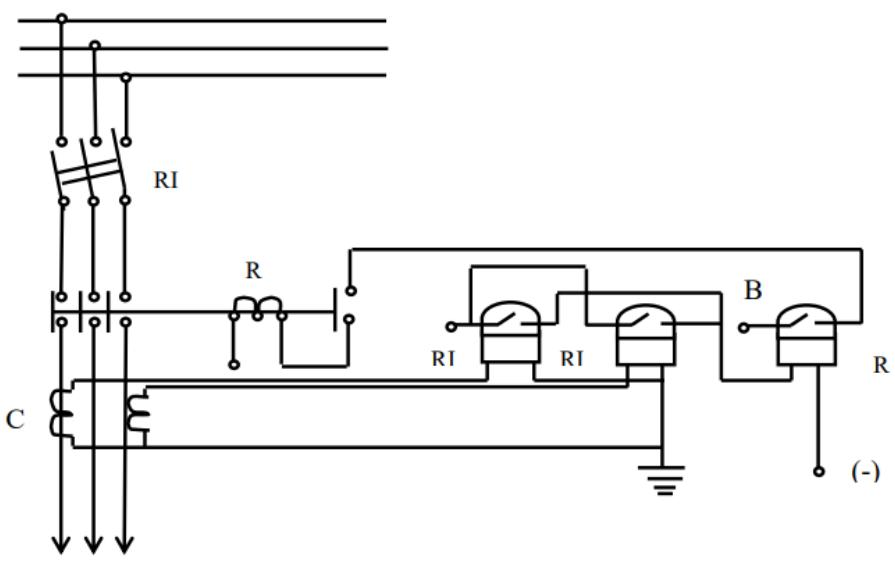
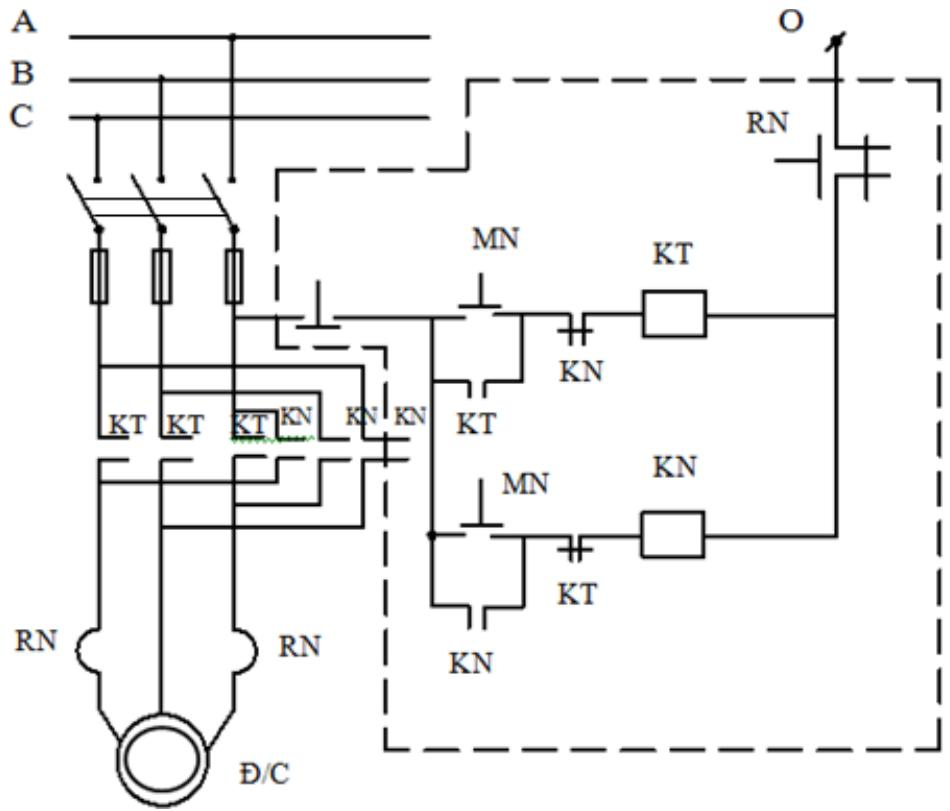

# 1. GIỚI THIỆU

Nội dung của chương này trình bày về các ký hiệu và trình bày sơ đồ nguyên lý và sơ đồ đi dây của một số mạch điện cơ bản.

# 2. MỤC TIÊU

Học xong chương này, người học có khả năng:

- Trình bày được nội dung ký hiệu quy ước trong bản vẽ hệ thống điện và các loại sơ đồ điện;

- Vẽ và đọc được một số sơ đồ điện;

- Thực hiện công việc trình bày bản vẽ cẩn thận, khoa học.

# 3. MỘT SỐ KÍ HIỆU QUY ƯỚC TRONG BẢN VẼ SƠ ĐỒ HỆ THỐNG ĐIỆN:

<table><tr><td colspan="1" rowspan="1">Ten cac phan tir tren so do</td><td colspan="3" rowspan="1">Ki hieu</td></tr><tr><td colspan="1" rowspan="1">May phat dien (F)</td><td colspan="3" rowspan="1">F               ~</td></tr><tr><td colspan="1" rowspan="1">Tram bién äp (TBA)</td><td colspan="3" rowspan="3">D</td></tr><tr><td colspan="1" rowspan="2">Tram phan phói, tram cät (TPP)</td><td colspan="1" rowspan="1"></td><td colspan="1" rowspan="1"></td></tr><tr><td colspan="1" rowspan="1"></td><td colspan="1" rowspan="1"></td></tr><tr><td colspan="1" rowspan="1">May bién ap (BA)</td><td colspan="3" rowspan="1"></td></tr><tr><td colspan="1" rowspan="1">May cat dien (MC)</td><td colspan="3" rowspan="1"></td></tr><tr><td colspan="1" rowspan="1">May bién ap do lrong (BU)</td><td colspan="3" rowspan="1">百</td></tr><tr><td colspan="1" rowspan="1">May bien dong dien (BI)</td><td colspan="3" rowspan="1">?</td></tr><tr><td colspan="1" rowspan="1">May cät phu tai (MCPT)Dao cat phu tai (DCPT)</td><td colspan="3" rowspan="1"></td></tr><tr><td colspan="1" rowspan="1">Dao cach ly (DCL)</td><td colspan="5" rowspan="1">/</td></tr><tr><td colspan="1" rowspan="1">Cau dao (CD)</td><td colspan="5" rowspan="1"></td></tr><tr><td colspan="1" rowspan="1">Cau chi (CC)</td><td colspan="5" rowspan="1">冏中I□I</td></tr><tr><td colspan="1" rowspan="1">Cau chi tur roi</td><td colspan="5" rowspan="1">贝               乡</td></tr><tr><td colspan="1" rowspan="1">Tu bu</td><td colspan="5" rowspan="1">工</td></tr><tr><td colspan="1" rowspan="1">Ap to mat (A)</td><td colspan="5" rowspan="1"></td></tr><tr><td colspan="1" rowspan="1">Khoi dong tur (KDT)Cong tac to (CT)</td><td colspan="5" rowspan="1">□</td></tr><tr><td colspan="1" rowspan="1">Dong co dien (D)</td><td colspan="5" rowspan="1">?</td></tr><tr><td colspan="1" rowspan="1">Thanh góp (thanh cai) (TG)</td><td colspan="5" rowspan="1"></td></tr><tr><td colspan="1" rowspan="1">Day trung tinh</td><td colspan="5" rowspan="1"></td></tr><tr><td colspan="1" rowspan="1">Day dan</td><td colspan="5" rowspan="1"></td></tr><tr><td colspan="1" rowspan="1">Den soi dot</td><td colspan="5" rowspan="1"></td></tr><tr><td colspan="1" rowspan="1">Den tiyp</td><td colspan="5" rowspan="1">FL</td></tr><tr><td colspan="1" rowspan="1">Chuong</td><td colspan="5" rowspan="1"></td></tr><tr><td colspan="1" rowspan="1">O va phich cam</td><td colspan="5" rowspan="1"></td></tr><tr><td colspan="1" rowspan="1">Cong tac (don, kép)</td><td colspan="5" rowspan="1"></td></tr><tr><td colspan="1" rowspan="1">Bang dien</td><td colspan="5" rowspan="1"></td></tr><tr><td colspan="1" rowspan="1">Dong ho von, Ampe, cosΦ</td><td colspan="5" rowspan="1">四?Ccos)</td></tr><tr><td colspan="1" rowspan="1">Cong to huru cong, cong to vo cong</td><td colspan="5" rowspan="1">KWh             KVAR</td></tr><tr><td colspan="1" rowspan="1">Noi dat</td><td colspan="5" rowspan="1"></td></tr><tr><td colspan="1" rowspan="1">Quat dien</td><td colspan="5" rowspan="1">0</td></tr><tr><td colspan="1" rowspan="1">Tiép diém thuong mo</td><td colspan="5" rowspan="1"></td></tr><tr><td colspan="1" rowspan="1">Tiép diem thuong dong</td><td colspan="5" rowspan="1">+</td></tr><tr><td colspan="1" rowspan="1">Nut an thuong mo</td><td colspan="5" rowspan="1"></td></tr><tr><td colspan="1" rowspan="1">Nut an thuong d6ng</td><td colspan="5" rowspan="1"></td></tr></table>

4. CÁC LOẠI SƠ ĐỒ ĐIỆN:

• Sơ đồ nhất thứ

- Khái niệm: Sơ đồ nhất thứ là sơ đồ biểu diễn các mạch điện chính của các trang bị điện, truyền tải năng lượng điện từ phía nguồn đến nơi tiêu thụ điện.

- Các loại sơ đồ nhất thứ: o Sơ đồ một sợi o Sơ đồ ba sợi

Sơ đồ một sợi: Là sơ đồ chỉ vẽ một pha để biểu thị sự liên hệ các trang bị điện. Do đó sơ đồ đơn giản trên sơ đồ chỉ biểu thị các trang bị điện chủ yếu như: máy phát điện, máy biến dòng điện, máy cắt điện và dao cách ly, máy biến á. Sơ đồ nhất thứ một sợi là sơ đồ thường dùng khi chọn thiết bị dùng trong vận hành.

  
Hinh 9-1: So do mot soi

Sơ đồ ba sợi: Sơ đồ ba sợi (dây) được dùng để biểu thị cho cả ba pha

# • Sơ đồ nhị thứ

Sơ đồ nối dây nhị thứ là hình vẽ biểu thị các thiết bị đo lường, kiểm tra, điều khiển, bảo vệ.

Nguồn cung cấp cho mạch nhị thứ là các máy biến dòng điện và máy biến điện áp, hoặc từ nguồn một chiều.

